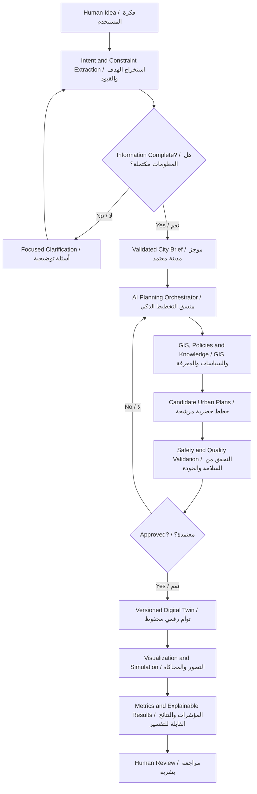
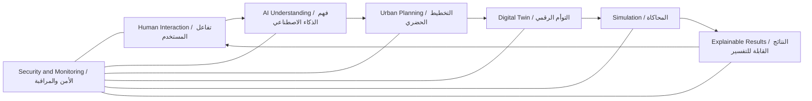

# 🏙️ AI Future Lab | مختبر المستقبل للذكاء الاصطناعي

**English + العربية**

> **From Human Ideas to Intelligent Cities**  
> **من الأفكار البشرية إلى المدن الذكية**

AI Future Lab is an AI-powered urban-planning concept that transforms a human idea into a structured city brief, an urban strategy, a digital twin, tested scenarios, and explainable recommendations.

AI Future Lab هو تصور لمنصة تخطيط حضري مدعومة بالذكاء الاصطناعي، تحول فكرة المستخدم إلى موجز مدينة منظم، واستراتيجية حضرية، وتوأم رقمي، وسيناريوهات قابلة للاختبار، وتوصيات قابلة للتفسير.

📖 **Full Arabic homepage | الصفحة العربية الكاملة:** [README_AR.md](README_AR.md)

---

## 🇦🇪 Why I Created This for the UAE | لماذا أنشأت هذا المشروع للإمارات؟

I created AI Future Lab because I want to contribute ideas that could support the future development of the United Arab Emirates.

As a young Emirati student interested in artificial intelligence, smart cities, sustainability, and future technology, I believe young people should not only wait for the future — they should help imagine and design it.

The project is currently a concept and system architecture, not a completed government or commercial platform. My goal is to share the idea, improve it, learn from professionals, and connect with people or organizations interested in innovative solutions for the UAE and the wider world.

أنشأت AI Future Lab لأنني أريد تقديم أفكار يمكن أن تساهم في التطور المستقبلي لدولة الإمارات العربية المتحدة.

بصفتي طالبًا إماراتيًا شابًا مهتمًا بالذكاء الاصطناعي والمدن الذكية والاستدامة وتقنيات المستقبل، أؤمن بأن الشباب لا ينبغي أن ينتظروا المستقبل فقط، بل يمكنهم المساهمة في تخيله وتصميمه.

المشروع حاليًا مفهوم وهيكل معماري للنظام، وليس منصة حكومية أو تجارية مكتملة. هدفي هو مشاركة الفكرة، وتحسينها، والتعلم من المتخصصين، والتواصل مع الجهات والأشخاص المهتمين بابتكار حلول للإمارات والعالم.

---

## 🎯 Project Vision | رؤية المشروع

A user could describe a future city in natural language:

> “Create a sustainable city for 100,000 residents with strong public transport, walkable neighborhoods, schools, hospitals, green spaces, renewable energy, and efficient water systems.”

يمكن للمستخدم وصف مدينة مستقبلية بلغة طبيعية:

> «أنشئ مدينة مستدامة تستوعب 100 ألف نسمة، مع نقل عام قوي، وأحياء مناسبة للمشي، ومدارس، ومستشفيات، ومساحات خضراء، وطاقة متجددة، وأنظمة مياه فعالة.»

AI Future Lab would:

1. Understand the idea and its goals — فهم الفكرة وأهدافها.
2. Detect missing or conflicting information — اكتشاف المعلومات الناقصة أو المتعارضة.
3. Ask focused clarification questions — طرح أسئلة توضيحية مركزة.
4. Produce a validated city brief — إنشاء موجز مدينة منظم ومعتمد.
5. Generate and compare planning options — توليد ومقارنة خطط بديلة.
6. Build a versioned digital twin — بناء توأم رقمي محفوظ الإصدارات.
7. Test planning scenarios — اختبار سيناريوهات التخطيط.
8. Measure accessibility, mobility, sustainability, capacity, and services — قياس الوصول والتنقل والاستدامة والسعة والخدمات.
9. Explain important recommendations — تفسير التوصيات المهمة.
10. Preserve feedback, evidence, and revisions — حفظ الملاحظات والأدلة والتعديلات.

---

## 🧠 How the AI Works | كيف يعمل الذكاء الاصطناعي؟

### AI responsibilities | مسؤوليات الذكاء الاصطناعي

- Natural-language understanding — فهم اللغة الطبيعية.
- Goal, entity, constraint, and preference extraction — استخراج الأهداف والكيانات والقيود والتفضيلات.
- Project and conversation memory — ذاكرة المشروع والمحادثة.
- Planning-task orchestration — تنسيق مهام التخطيط.
- Knowledge retrieval and grounding — استرجاع المعرفة وربطها بالمصادر.
- Candidate-plan generation and comparison — إنشاء الخطط البديلة ومقارنتها.
- Structured-output and planning validation — التحقق من المخرجات وقواعد التخطيط.
- Safety, fairness, and hallucination checks — فحوص السلامة والإنصاف والهلوسة.
- Decision explanations — تفسير القرارات.
- Controlled learning and ModelOps — التعلم الخاضع للرقابة وإدارة النماذج.

Detailed AI workflows | شرح مسارات الذكاء الاصطناعي:

- [English](docs/AI_MODEL_WORKFLOWS.md)
- [العربية](docs/ar/AI_MODEL_WORKFLOWS.md)

---

## ✨ Key Capabilities | القدرات الرئيسية

| English | العربية |
|---|---|
| Voice and text city input | إدخال فكرة المدينة بالصوت أو النص |
| Structured city brief | موجز مدينة منظم |
| Land-use and zoning strategy | استراتيجية استخدامات الأراضي والتقسيم |
| District, housing, and density planning | تخطيط الأحياء والمساكن والكثافة |
| Roads, transit, walking, and cycling | الطرق والنقل العام والمشاة والدراجات |
| Schools, healthcare, and public services | المدارس والرعاية الصحية والخدمات العامة |
| Energy, water, waste, and infrastructure | الطاقة والمياه والنفايات والبنية التحتية |
| Digital twin and version history | التوأم الرقمي وسجل الإصدارات |
| Scenario simulation and comparison | محاكاة السيناريوهات ومقارنتها |
| Explainable reports and recommendations | تقارير وتوصيات قابلة للتفسير |
| Security, recovery, and human governance | الأمن والاستعادة والحوكمة البشرية |

---

## 🏗️ System Architecture | هيكل النظام

The architecture is modular, traceable, explainable, and designed around human approval.

الهيكل مقسم إلى وحدات مستقلة، وقابل للتتبع والتفسير، ويعتمد على المراجعة والموافقة البشرية.

---

## 🗺️ Workflow Library | مكتبة مخططات العمل

| # | Workflow / مخطط العمل | Purpose / الغرض |
|---|---|---|
| 1 | [Master Overview / النظرة العامة](https://whimsical.com/6EdTLepAE6eS55uTTtqcny) | Complete lifecycle / دورة النظام كاملة |
| 2 | [Human Input & AI Understanding / إدخال المستخدم وفهم الذكاء](https://whimsical.com/8F6utnKkwo8pFn6xxGbTgx) | Intent, constraints, clarification / الهدف والقيود والتوضيح |
| 3 | [AI Core Architecture / بنية الذكاء الاصطناعي](https://whimsical.com/V9YjzMedP4ibnudKTGNvbo) | Memory, orchestration, validation / الذاكرة والتنسيق والتحقق |
| 4 | [Urban Planning & Digital Twin / التخطيط والتوأم الرقمي](https://whimsical.com/Bp31XsuU3761Eo6aJJJz6Z) | City systems and versions / أنظمة المدينة والإصدارات |
| 5 | [City Generation & Simulation / إنشاء المدينة والمحاكاة](https://whimsical.com/48bkuxGhVnjNmJqQV4tcye) | Visualization and scenarios / التصور والسيناريوهات |
| 6 | [Results & Explainability / النتائج والتفسير](https://whimsical.com/5ZnfDhpTdQKJFdnQB3xgiH) | Evidence and recommendations / الأدلة والتوصيات |
| 7 | [Errors & Recovery / الأخطاء والاستعادة](https://whimsical.com/L4WgEGjtVvKZ2kSSLAcfVy) | Retry, repair, rollback / إعادة المحاولة والإصلاح والرجوع |
| 8 | [Security, APIs & Monitoring / الأمن وAPI والمراقبة](https://whimsical.com/3bt9QRsL4FvkR8RL1BvRhV) | Privacy and observability / الخصوصية والمراقبة |
| 9 | [Learning & Optimization / التعلم والتحسين](https://whimsical.com/SJJ5wWcQCLCSXS4ccNgC1a) | Controlled improvement / التحسين الخاضع للرقابة |
| 10 | [Deployment & Operations / النشر والعمليات](https://whimsical.com/3U7GqN6YdcpV3PRddLezDg) | Testing, release, scaling / الاختبار والنشر والتوسع |
| 11 | [Final Integrated Architecture / الهيكل النهائي](https://whimsical.com/Us2JN5AFmp69T3iVanPp4z) | Complete connected system / النظام المتكامل الكامل |
| 12–14 | [AI Model Workflows / مسارات نماذج الذكاء](docs/AI_MODEL_WORKFLOWS.md) | Prompt orchestration, RAG, guardrails, ModelOps / التعليمات وRAG والحماية وإدارة النماذج |

---

## 🎮 Engine Demonstrations | أمثلة محركات العرض

The repository contains small educational city-generation examples. They demonstrate possible visualization connectors and are not the complete AI platform.

يتضمن المستودع أمثلة تعليمية صغيرة لإنشاء المدينة. وهي توضح طريقة عرض البيانات مستقبلًا وليست المنصة الكاملة.

- **Godot 4:** [English](examples/godot/README.md) | [العربية](examples/godot/README_AR.md)
- **Unity:** [English](examples/unity/README.md) | [العربية](examples/unity/README_AR.md)
- **Unreal Engine 5:** [English](examples/unreal/README.md) | [العربية](examples/unreal/README_AR.md)

---

## 📚 Documentation | الوثائق

### English

- [Project Vision](docs/01-project-vision.md)
- [Problem and Solution](docs/02-problem-and-solution.md)
- [How It Works](docs/03-how-it-works.md)
- [System Architecture](docs/04-system-architecture.md)
- [Workflow Library](docs/05-workflow-library.md)
- [Feature Set](docs/06-feature-set.md)
- [Roadmap](docs/07-roadmap.md)
- [Safety and Governance](docs/08-safety-and-governance.md)
- [Future Scope](docs/09-future-scope.md)

### العربية

- [الوثائق العربية الكاملة](docs/ar/COMPLETE_DOCUMENTATION.md)
- [مسارات عمل الذكاء الاصطناعي](docs/ar/AI_MODEL_WORKFLOWS.md)
- [مكتبة مخططات العمل](docs/ar/WORKFLOW_LIBRARY.md)
- [العرض التعريفي العربي](PROJECT_PITCH_AR.md)

---

## 🧪 Project Status | حالة المشروع

**Current stage / المرحلة الحالية:** Concept architecture, public documentation, visual workflows, and educational demonstrations.  
**مفهوم، وهيكل معماري، ووثائق عامة، ومخططات بصرية، وأمثلة تعليمية.**

### Completed | تم إنجازه

- Product vision and architecture — رؤية المشروع وهيكل النظام.
- Eleven visual workflow boards — أحد عشر مخطط عمل بصريًا.
- AI model workflow specification — تصميم مسارات نماذج الذكاء الاصطناعي.
- Safety, security, recovery, and roadmap — السلامة والأمن والاستعادة وخارطة الطريق.
- Starter Godot, Unity, and Unreal examples — أمثلة أولية للمحركات الثلاثة.

### Not completed yet | لم يتم إنجازه بعد

- Production AI planner — مخطط ذكاء اصطناعي إنتاجي.
- Live GIS and professional city datasets — بيانات GIS مباشرة واحترافية.
- Professional traffic and utility simulation — محاكاة احترافية للنقل والمرافق.
- Deployed full web platform — منصة ويب كاملة ومنشورة.

---

## 🤝 Contact, Collaboration & Permission | التواصل والتعاون وطلب الإذن

The repository is public for portfolio, educational viewing, and project presentation. It does not grant permission to copy, redistribute, commercially use, or present the project as another person's original work.

المستودع متاح للعامة لأغراض العرض والتعلم، لكنه لا يمنح إذنًا لنسخ المشروع أو إعادة نشره أو استخدامه تجاريًا أو نسبه لشخص آخر.

For collaboration or permission requests, open a GitHub Issue using one of the bilingual forms:

للتعاون أو طلب الإذن، افتح طلبًا من صفحة **Issues** باستخدام أحد النماذج الثنائية اللغة:

- **Permission Request | طلب إذن**
- **Collaboration Proposal | اقتراح تعاون**

Read / اقرأ: [PERMISSION.md](PERMISSION.md)

---

## 👤 Creator | صاحب الفكرة

> **Young Emirati Innovator, Concept Creator, and System Architecture Designer of AI Future Lab.**  
> **مبتكر إماراتي شاب، وصاحب مفهوم AI Future Lab، ومصمم هيكل النظام.**

Personal school details, exact age, home address, phone number, private email, and daily location are intentionally excluded for privacy and safety.

لا يتم نشر العمر الدقيق أو المدرسة أو العنوان أو رقم الهاتف أو البريد الشخصي أو الموقع اليومي حفاظًا على الخصوصية والسلامة.

---

## 📄 Copyright | الحقوق

All rights reserved. جميع الحقوق محفوظة. See / راجع: [LICENSE.md](LICENSE.md).