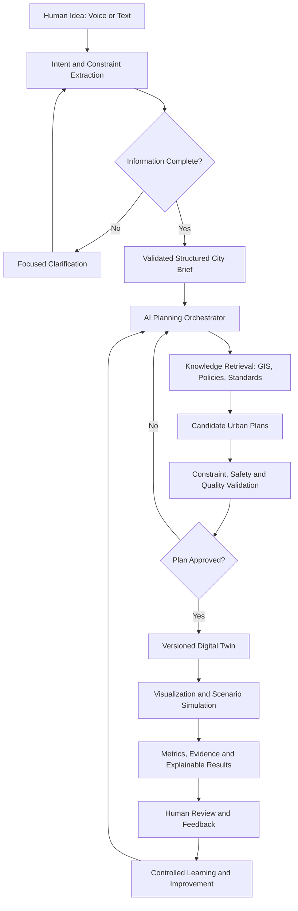
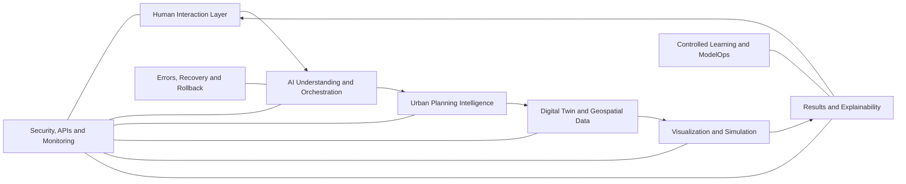

# 🏙️ AI Future Lab

[](#-how-the-ai-works)
[](#-project-vision)
[](#-system-architecture)
[](examples/godot)
[](examples/unity)
[](examples/unreal)
[](#-project-status)

> **From Human Ideas to Intelligent Cities**

AI Future Lab is an AI-powered urban-planning concept that transforms a human idea into a structured city brief, a planning strategy, a digital twin, tested scenarios, and explainable recommendations.

It is not a normal chatbot, a traditional city simulator, or a game. It is a proposed intelligent planning environment where a user can describe a city through text or voice and an AI urban planner can understand the request, identify goals and constraints, generate planning strategies, validate decisions, create a digital city model, compare scenarios, and explain why each recommendation was made.

---

## 🎯 Project Vision

A user could describe a future city in natural language:

> “Create a sustainable city for 100,000 residents with strong public transport, walkable neighborhoods, schools, hospitals, green spaces, renewable energy, and efficient water systems.”

AI Future Lab would then:

1. Understand the idea.
2. Detect missing or conflicting information.
3. Ask focused clarification questions.
4. Produce a validated city brief.
5. Generate and compare urban-planning options.
6. Build a versioned digital twin.
7. test planning scenarios.
8. Measure accessibility, mobility, sustainability, capacity, and service coverage.
9. Explain every important recommendation.
10. Preserve feedback, evidence, and revisions.

---

## 🧠 How the AI Works



### AI responsibilities

- Natural-language understanding
- Goal, entity, constraint, and preference extraction
- Conversation and project memory
- Planning-task orchestration
- Knowledge retrieval and grounding
- Candidate-plan generation
- Multi-objective comparison
- Structured-output validation
- Safety and planning-rule checks
- Decision explanations
- Feedback analysis
- Controlled model improvement

### AI model pipeline

```text
User Request
→ Context Builder
→ Prompt and Task Builder
→ Model Router
→ AI Model
→ Tool Calling
→ Structured JSON Output
→ Schema Validation
→ Planning Validation
→ Approved Response or Safe Retry
```

### Knowledge retrieval pipeline

```text
Planning Question
→ Retrieval Query
→ GIS and Site Data
→ Planning Policies and Standards
→ City Knowledge Base
→ Relevant Evidence Ranking
→ Grounded AI Context
→ Planning Recommendation with Sources
```

### AI evaluation and guardrails

```text
AI Output
→ Accuracy Evaluation
→ Hallucination Check
→ Constraint Validation
→ Safety Review
→ Fairness Review
→ Cost and Latency Monitoring
→ Human Approval
→ Release or Rejection
```

Full explanation: [AI Model Workflows](docs/AI_MODEL_WORKFLOWS.md)

---

## ✨ Key Capabilities

### Human interaction

- Voice and text project input
- Multilingual communication
- Focused clarification questions
- Conversation history
- User feedback and approvals

### Urban planning

- Land-use and zoning strategy
- District and neighborhood generation
- Density and housing distribution
- Road hierarchy and public transport
- Walking and cycling networks
- Schools, healthcare, and public services
- Energy, water, waste, and infrastructure
- Sustainability and climate resilience

### Digital twin and simulation

- Versioned city-object model
- Spatial relationships
- Scenario history
- Planning metrics
- Population-growth scenarios
- Traffic and mobility analysis
- Utility-capacity analysis
- Service-accessibility analysis
- Environmental and resilience scenarios

### Explainable results

- Decision summaries
- Assumptions and uncertainty
- Alternatives and trade-offs
- Evidence and validation results
- Executive and technical reports
- Human-readable recommendations

---

## 🏗️ System Architecture



The architecture is modular so each specialist layer can be tested, improved, replaced, or scaled independently.

Detailed documentation: [System Architecture](docs/04-system-architecture.md)

---

## 🗺️ Visual Workflow Library

The complete project architecture is organized into eleven connected Whimsical boards, plus an additional AI model-workflow specification.

| # | Workflow | Purpose |
|---|---|---|
| 1 | [Master Overview](https://whimsical.com/6EdTLepAE6eS55uTTtqcny) | Complete system lifecycle |
| 2 | [Human Input & AI Understanding](https://whimsical.com/8F6utnKkwo8pFn6xxGbTgx) | Intent, constraints, clarification, and city brief |
| 3 | [AI Core Architecture](https://whimsical.com/V9YjzMedP4ibnudKTGNvbo) | Reasoning, memory, orchestration, and validation |
| 4 | [Urban Planning & Digital Twin](https://whimsical.com/Bp31XsuU3761Eo6aJJJz6Z) | City systems and versioned digital state |
| 5 | [City Generation & Simulation](https://whimsical.com/48bkuxGhVnjNmJqQV4tcye) | Visualization and scenario execution |
| 6 | [Results & Explainability](https://whimsical.com/5ZnfDhpTdQKJFdnQB3xgiH) | Evidence, reports, recommendations, and feedback |
| 7 | [Errors & Recovery](https://whimsical.com/L4WgEGjtVvKZ2kSSLAcfVy) | Failure detection, repair, retry, and rollback |
| 8 | [Security, APIs & Monitoring](https://whimsical.com/3bt9QRsL4FvkR8RL1BvRhV) | Identity, privacy, safe APIs, and observability |
| 9 | [Learning & Autonomous Optimization](https://whimsical.com/SJJ5wWcQCLCSXS4ccNgC1a) | Controlled feedback-driven improvement |
| 10 | [Deployment & Production Operations](https://whimsical.com/3U7GqN6YdcpV3PRddLezDg) | Testing, staging, release, monitoring, and scaling |
| 11 | [Final Integrated Architecture](https://whimsical.com/Us2JN5AFmp69T3iVanPp4z) | Complete connected architecture |
| 12–14 | [AI Model Workflows](docs/AI_MODEL_WORKFLOWS.md) | Prompt orchestration, RAG, evaluation, guardrails, and ModelOps |

Workflow colors:

- 🔵 Blue — AI and system processes
- 🟢 Mint — execution
- 🟠 Orange — decisions
- 🟡 Yellow — review and retry
- 🔴 Red — errors and recovery
- 🟣 Purple — AI engine, runtime, or user experience
- ⚪ Gray — approved states and milestones

---

## 🎮 Engine Demonstrations

This repository includes small procedural city-generator examples for three engines. They demonstrate how approved city data could eventually be visualized. They are not the complete AI platform.

### Godot 4

Creates a ground plane, road grid, procedural buildings, camera, and lighting.

Open:

```text
examples/godot/project.godot
```

### Unity

Creates a ground plane, road grid, procedural buildings, camera, and directional light.

Use:

```text
examples/unity/Assets/Scripts/CityGenerator.cs
```

### Unreal Engine 5

Provides an editor-adjustable C++ `ACityGenerator` actor that creates ground, roads, and procedural building blocks.

Open:

```text
examples/unreal/AIFutureLab/AIFutureLab.uproject
```

See [Demonstration Status](TEST_STATUS.md) before using the examples.

---

## 📁 Repository Structure

```text
AI-Future-Lab/
├── README.md
├── PROJECT_PITCH.md
├── TEST_STATUS.md
├── SECURITY.md
├── CONTRIBUTING.md
├── LICENSE.md
├── docs/
│   ├── 01-project-vision.md
│   ├── 02-problem-and-solution.md
│   ├── 03-how-it-works.md
│   ├── 04-system-architecture.md
│   ├── 05-workflow-library.md
│   ├── 06-feature-set.md
│   ├── 07-roadmap.md
│   ├── 08-safety-and-governance.md
│   ├── 09-future-scope.md
│   ├── AI_MODEL_WORKFLOWS.md
│   └── WORKFLOW_ARCHITECTURE.md
└── examples/
    ├── godot/
    ├── unity/
    └── unreal/
```

---

## 🚀 Future Technology Direction

The main platform is planned as a lightweight web application rather than depending on a game engine.

Possible future stack:

- **Frontend:** Next.js and TypeScript
- **Interactive maps:** MapLibre GL JS
- **Database and authentication:** PostgreSQL and Supabase
- **Geospatial data:** GeoJSON and spatial database extensions
- **AI orchestration:** Server-side model and tool routing
- **Simulation:** Browser workers and backend calculation services
- **Reporting:** Dashboards and exportable documents
- **Engine visualization:** Optional Godot, Unity, or Unreal connectors

---

## 🧪 Project Status

**Current stage:** concept architecture, public documentation, visual workflows, and educational engine demonstrations.

Completed:

- Product vision
- End-to-end architecture
- Eleven visual workflow boards
- AI orchestration specification
- Safety and recovery design
- Roadmap and public project documentation
- Starter visualization examples

Not yet completed:

- Production AI planner
- Trained or connected planning model
- Live GIS database
- Professional transport or utility simulation
- Deployed web platform
- Verified engine builds across all versions

The repository intentionally separates completed architecture from future implementation.

---

## 🛡️ Responsible AI

AI Future Lab is designed as a decision-support system, not a replacement for licensed planners, engineers, architects, or public authorities.

Every major recommendation should include:

- The recommendation
- The reason for it
- The data and assumptions used
- Alternatives considered
- Trade-offs
- Uncertainty
- Required human approval

Read: [Safety and Governance](docs/08-safety-and-governance.md)

---

## 🤝 Contributing

Constructive educational feedback is welcome in:

- Artificial intelligence
- Urban planning
- Smart cities
- Digital twins
- Geospatial systems
- Sustainability
- Explainable AI
- System architecture
- Godot, Unity, and Unreal development

See [CONTRIBUTING.md](CONTRIBUTING.md).

---

## 👤 Author

Created by a young student innovator exploring artificial intelligence, smart cities, system architecture, and future technology.

Personal school details, home address, phone number, private email, exact age, and daily location are intentionally excluded for privacy and safety.

---

## 📄 Copyright

All rights reserved. See [LICENSE.md](LICENSE.md).
