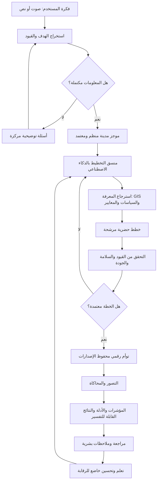
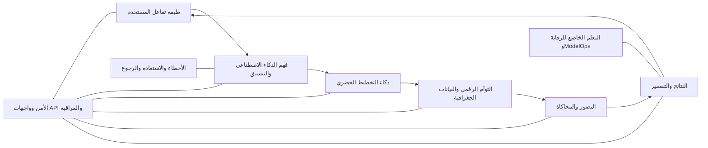

# 🏙️ مختبر المستقبل للذكاء الاصطناعي — AI Future Lab

[](#-كيف-يعمل-الذكاء-الاصطناعي)
[](#-رؤية-المشروع)
[](#-هيكل-النظام)
[](examples/godot)
[](examples/unity)
[](examples/unreal)

**[English Version](README.md) | النسخة العربية**

> **من الأفكار البشرية إلى المدن الذكية**

AI Future Lab هو تصور لمنصة تخطيط حضري مدعومة بالذكاء الاصطناعي، تحول فكرة المستخدم إلى موجز مدينة منظم، واستراتيجية تخطيط، وتوأم رقمي، وسيناريوهات قابلة للاختبار، وتوصيات قابلة للفهم والتفسير.

المشروع ليس روبوت محادثة عاديًا، ولا لعبة أو محاكي مدينة تقليديًا. إنه تصور لبيئة تخطيط ذكية يستطيع فيها المستخدم وصف مدينة من خلال النص أو الصوت، ثم يقوم مخطط حضري مدعوم بالذكاء الاصطناعي بفهم الطلب، وتحديد الأهداف والقيود، واقتراح استراتيجيات التخطيط، والتحقق من القرارات، وإنشاء نموذج رقمي للمدينة، ومقارنة السيناريوهات، وشرح سبب كل توصية.

---

## 🇦🇪 لماذا أنشأت هذا المشروع للإمارات؟

أنشأت AI Future Lab لأنني أريد تقديم أفكار يمكن أن تساهم في التطور المستقبلي لدولة الإمارات العربية المتحدة.

بصفتي طالبًا إماراتيًا شابًا مهتمًا بالذكاء الاصطناعي، والمدن الذكية، والاستدامة، وتقنيات المستقبل، أؤمن بأن الشباب لا ينبغي أن ينتظروا المستقبل فقط، بل يمكنهم المساهمة في تخيله وتصميمه.

يمثل هذا المشروع رؤيتي لكيفية مساعدة الذكاء الاصطناعي للمخططين والجهات الحكومية والمطورين والمهندسين والمجتمعات على استكشاف مدن أفضل قبل البدء في بنائها فعليًا.

المشروع حاليًا عبارة عن مفهوم وهيكل معماري للنظام، وليس منصة حكومية أو تجارية مكتملة. هدفي هو مشاركة الفكرة، وتحسينها باستمرار، والتعلم من المتخصصين، والتواصل مع الجهات والأشخاص المهتمين بتطوير حلول مبتكرة للإمارات والعالم.

---

## 🎯 رؤية المشروع

يمكن للمستخدم أن يصف مدينة مستقبلية بلغة طبيعية، مثل:

> «أنشئ مدينة مستدامة تستوعب 100 ألف نسمة، مع نقل عام قوي، وأحياء مناسبة للمشي، ومدارس، ومستشفيات، ومساحات خضراء، وطاقة متجددة، وأنظمة مياه فعالة.»

ثم يقوم AI Future Lab بما يلي:

1. فهم الفكرة والهدف الأساسي.
2. اكتشاف المعلومات الناقصة أو المتعارضة.
3. طرح أسئلة توضيحية مركزة.
4. إنشاء موجز مدينة منظم ومعتمد.
5. توليد ومقارنة عدة خيارات للتخطيط الحضري.
6. بناء توأم رقمي للمدينة مع حفظ الإصدارات.
7. اختبار سيناريوهات مختلفة.
8. قياس الوصول والتنقل والاستدامة والسعة وتغطية الخدمات.
9. شرح كل توصية مهمة.
10. حفظ الملاحظات والأدلة والتعديلات السابقة.

---

## 🧠 كيف يعمل الذكاء الاصطناعي؟



### مسؤوليات الذكاء الاصطناعي

- فهم اللغة الطبيعية.
- استخراج الأهداف والكيانات والقيود والتفضيلات.
- إدارة ذاكرة المحادثة والمشروع.
- تنسيق مهام التخطيط.
- استرجاع المعلومات من مصادر موثوقة.
- توليد خطط بديلة ومقارنتها.
- التحقق من المخرجات المنظمة.
- تطبيق قواعد السلامة والتخطيط.
- تفسير القرارات والتوصيات.
- تحليل ملاحظات المستخدم.
- تحسين النظام ضمن اختبارات وموافقات بشرية.

### مسار نموذج الذكاء الاصطناعي

```text
طلب المستخدم
→ بناء السياق
→ بناء المهمة والتعليمات
→ اختيار النموذج المناسب
→ نموذج الذكاء الاصطناعي
→ استدعاء الأدوات
→ مخرجات JSON منظمة
→ التحقق من المخطط
→ التحقق من قواعد التخطيط
→ اعتماد النتيجة أو إعادة المحاولة بأمان
```

اقرأ الشرح التفصيلي: [مسارات عمل نماذج الذكاء الاصطناعي](docs/ar/AI_MODEL_WORKFLOWS.md)

---

## ✨ القدرات الرئيسية

### التواصل مع المستخدم

- إدخال الفكرة بالصوت أو النص.
- دعم عدة لغات.
- أسئلة توضيحية ذكية.
- حفظ المحادثات والتعديلات.
- الموافقة والرفض وطلب البدائل.

### التخطيط الحضري

- استخدامات الأراضي والتقسيمات.
- إنشاء المناطق والأحياء.
- الكثافة وتوزيع المساكن.
- الطرق والنقل العام.
- شبكات المشاة والدراجات.
- المدارس والمستشفيات والخدمات.
- الطاقة والمياه والنفايات والبنية التحتية.
- الاستدامة والمرونة المناخية.

### التوأم الرقمي والمحاكاة

- نموذج رقمي محفوظ الإصدارات.
- العلاقات المكانية بين عناصر المدينة.
- سجل السيناريوهات والمؤشرات.
- نمو السكان والطلب المستقبلي.
- تحليل الحركة والوصول للخدمات.
- تقييم سعة المرافق.
- سيناريوهات البيئة والمناخ والطوارئ.

### النتائج القابلة للتفسير

- ملخصات القرارات.
- الافتراضات ومستوى عدم اليقين.
- البدائل والمقايضات.
- الأدلة ونتائج التحقق.
- تقارير تنفيذية وتقنية.
- توصيات واضحة بلغة بسيطة.

---

## 🏗️ هيكل النظام



الهيكل مقسم إلى وحدات مستقلة، بحيث يمكن اختبار كل طبقة وتطويرها أو استبدالها دون إعادة بناء النظام كاملًا.

---

## 🗺️ مكتبة مخططات العمل

| # | مخطط العمل | الغرض |
|---|---|---|
| 1 | [النظرة العامة](https://whimsical.com/6EdTLepAE6eS55uTTtqcny) | دورة حياة النظام كاملة |
| 2 | [إدخال المستخدم وفهم الذكاء الاصطناعي](https://whimsical.com/8F6utnKkwo8pFn6xxGbTgx) | فهم الهدف والقيود والأسئلة التوضيحية |
| 3 | [البنية الأساسية للذكاء الاصطناعي](https://whimsical.com/V9YjzMedP4ibnudKTGNvbo) | المنطق والذاكرة والتنسيق والتحقق |
| 4 | [التخطيط الحضري والتوأم الرقمي](https://whimsical.com/Bp31XsuU3761Eo6aJJJz6Z) | تحويل الخطة إلى حالة رقمية للمدينة |
| 5 | [إنشاء المدينة والمحاكاة](https://whimsical.com/48bkuxGhVnjNmJqQV4tcye) | التصور وتنفيذ السيناريوهات |
| 6 | [النتائج وقابلية التفسير](https://whimsical.com/5ZnfDhpTdQKJFdnQB3xgiH) | الأدلة والتقارير والتوصيات |
| 7 | [الأخطاء والاستعادة](https://whimsical.com/L4WgEGjtVvKZ2kSSLAcfVy) | اكتشاف الأعطال والإصلاح والرجوع |
| 8 | [الأمن وAPI والمراقبة](https://whimsical.com/3bt9QRsL4FvkR8RL1BvRhV) | الهوية والخصوصية والمراقبة |
| 9 | [التعلم والتحسين الذاتي](https://whimsical.com/SJJ5wWcQCLCSXS4ccNgC1a) | التحسين الخاضع للاختبار والموافقة |
| 10 | [النشر وعمليات الإنتاج](https://whimsical.com/3U7GqN6YdcpV3PRddLezDg) | الاختبار والنشر والمراقبة والتوسع |
| 11 | [الهيكل النهائي المتكامل](https://whimsical.com/Us2JN5AFmp69T3iVanPp4z) | جميع طبقات النظام في مخطط واحد |
| 12–14 | [مسارات عمل نماذج الذكاء الاصطناعي](docs/ar/AI_MODEL_WORKFLOWS.md) | التعليمات وRAG والتقييم والحماية وModelOps |

---

## 🎮 أمثلة محركات العرض

يتضمن المستودع أمثلة تعليمية صغيرة لإنشاء مدينة إجرائيًا في ثلاثة محركات. الغرض منها توضيح كيفية عرض بيانات المدينة مستقبلًا، وليست النظام الكامل.

- **Godot 4:** [التعليمات العربية](examples/godot/README_AR.md)
- **Unity:** [التعليمات العربية](examples/unity/README_AR.md)
- **Unreal Engine 5:** [التعليمات العربية](examples/unreal/README_AR.md)

---

## 🧪 حالة المشروع

**المرحلة الحالية:** مفهوم، وهيكل معماري، ومخططات عمل، ووثائق عامة، وأمثلة تعليمية للتصور.

### تم إنجازه

- رؤية المشروع.
- الهيكل الكامل للنظام.
- أحد عشر مخطط عمل بصريًا.
- تصميم مسارات الذكاء الاصطناعي.
- الأمن والاستعادة والحوكمة.
- خارطة طريق للتطوير.
- أمثلة أولية لمحركات العرض.

### لم يتم إنجازه بعد

- منصة ذكاء اصطناعي إنتاجية مكتملة.
- نموذج تخطيط حضري متصل فعليًا.
- قاعدة GIS مباشرة.
- محاكاة احترافية للنقل أو المرافق.
- منصة ويب منشورة للعامة.
- اختبار جميع أمثلة المحركات على كل الإصدارات.

---

## 🤝 التواصل والتعاون وطلب الإذن

يمكن مشاهدة المشروع لأغراض العرض والتعلم، لكن لا يمنح المستودع إذنًا لنسخ الفكرة أو إعادة نشرها أو استخدامها تجاريًا أو نسبها لشخص آخر.

للتعاون، أو البحث، أو مناقشة تطوير المشروع، أو طلب الإذن باستخدام جزء منه، افتح نموذجًا من صفحة **Issues**:

- **Permission Request | طلب إذن**
- **Collaboration Proposal | اقتراح تعاون**

التفاصيل: [سياسة الإذن والتواصل](PERMISSION.md)

---

## 👤 عن صاحب الفكرة

> **مبتكر إماراتي شاب، وصاحب مفهوم AI Future Lab، ومصمم هيكل النظام.**

الهدف هو تعلم تقنيات المستقبل، وتطوير أفكار مسؤولة، والمساهمة برؤى يمكن أن تدعم مستقبل دولة الإمارات.

لا يتم نشر العمر الدقيق أو المدرسة أو رقم الهاتف أو العنوان أو البريد الشخصي حفاظًا على الخصوصية والسلامة.

---

## 📄 الحقوق

جميع الحقوق محفوظة. راجع [LICENSE.md](LICENSE.md).