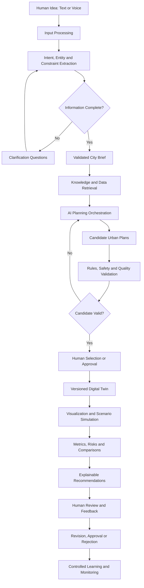

# 03 — How It Works

**English | [العربية](ar/03-how-it-works.md)**

This document explains the proposed end-to-end operation of AI Future Lab. It shows what enters each stage, what the system does, what the stage should produce, how the result is checked, and what happens when information is missing or incorrect.

The complete production system described here has not yet been implemented.

---

## 1. Complete Lifecycle



---

# Stage 1 — Human Input

## Purpose

Capture the user’s idea in a natural and accessible way.

## Possible input methods

- Typed text
- Recorded or live voice
- A guided questionnaire
- Uploaded project documents
- A map location or site boundary
- Existing project data
- A previous city-plan version

## Example user request

> “Plan a sustainable district for 70,000 people with mixed housing, schools, healthcare, parks, public transport, cycling routes, renewable energy, and low water consumption.”

## Information the system tries to identify

- Project name
- Country, city, or site
- Site boundary and area
- Target population
- Development period
- Budget assumptions
- Housing types
- Employment and commercial needs
- Education and healthcare services
- Roads and transport
- Walking and cycling goals
- Parks and public spaces
- Energy, water, and waste targets
- Climate and resilience priorities
- Special community requirements
- User priorities

## Output

A raw project-intake record containing the original request and any files or map selections supplied by the user.

## Validation

The system checks:

- Whether the input can be read
- Whether files are supported
- Whether the user is authorized to upload the data
- Whether private information is included unnecessarily
- Whether the request contains harmful, illegal, or impossible instructions

## Failure handling

If voice transcription fails, the system should ask the user to confirm or correct the text. It should not silently continue with an uncertain transcription.

---

# Stage 2 — AI Understanding

## Purpose

Convert unstructured language into structured planning information.

## Main tasks

### Language detection

The system identifies the language and should eventually support Arabic and English project conversations.

### Intent extraction

The AI identifies what the user is trying to achieve.

Example:

```text
Intent: create a sustainable mixed-use district
```

### Entity extraction

The AI identifies specific values and named requirements.

Example:

```text
Population: 70,000
Required services: schools, healthcare, parks
Mobility: public transport, cycling, walking
Sustainability: renewable energy, low water demand
```

### Constraint extraction

Constraints may include:

- Maximum site area
- Budget limits
- Protected land
- Existing roads
- Building-height limits
- Minimum service standards
- Required completion date

### Priority extraction

The system should understand which goals are most important.

Example:

```text
1. Public-transport accessibility
2. Water efficiency
3. Family-friendly neighborhoods
4. Development capacity
```

### Conflict detection

The system identifies requirements that may be difficult to satisfy together.

Example:

- Very low density
- Very short travel distance
- Maximum development capacity
- Minimum infrastructure cost

These goals may require trade-offs.

## Output

A structured draft containing:

- Confirmed facts
- Possible assumptions
- Missing information
- Conflicts
- Questions requiring human answers

## Validation

The AI output must match a defined data structure. Important numerical values should be shown to the user for confirmation.

---

# Stage 3 — Clarification

## Purpose

Resolve missing, unclear, or conflicting information before planning begins.

## Good clarification questions

Questions should be focused and necessary.

Examples:

- “What is the approximate site area?”
- “Should public transport be the primary travel mode?”
- “What housing mix is required?”
- “Is the project expected to develop in phases?”
- “Which requirement has higher priority: lower density or shorter travel distance?”
- “Are there existing roads or utilities that must be preserved?”

## Questions the system should avoid

- Questions already answered
- Questions unrelated to the project
- Large groups of technical questions without explanation
- Questions that assume private or confidential information is required
- Questions that a professional data source should answer instead of the user

## Clarification loop

```text
Missing information detected
→ Ask focused question
→ Receive answer
→ Update structured draft
→ Recheck completeness and conflicts
→ Ask again only when necessary
```

## Output

An updated project draft with fewer unknowns and clearly recorded assumptions.

---

# Stage 4 — Validated City Brief

## Purpose

Create the official source of truth for the current planning version.

## Suggested city-brief structure

### Project identity

- Project name
- Site
- Owner or responsible organization
- Current version
- Date

### Vision and objectives

- Main project goal
- Intended community
- Long-term outcomes

### Population and development

- Initial population
- Future population
- Development phases
- Housing requirements
- Employment targets

### Land use

- Residential
- Commercial
- Employment
- Education
- Healthcare
- Parks
- Utilities
- Special uses

### Mobility

- Road hierarchy
- Public transport
- Walking
- Cycling
- Parking
- Emergency access

### Sustainability

- Energy targets
- Water targets
- Waste strategy
- Green-space targets
- Heat and climate resilience

### Rules and constraints

- Site limits
- Policy requirements
- Protected areas
- Budget assumptions
- Schedule assumptions

### Open items

- Unresolved questions
- Data still required
- Professional reviews required

## Approval

The user or responsible reviewer must confirm the city brief before the system treats it as approved.

## Versioning

Every approved change creates a new version. Previous versions remain available for comparison and rollback.

---

# Stage 5 — Knowledge and Data Retrieval

## Purpose

Provide the AI with trusted project-specific information.

## Possible data sources

- Site boundaries
- Topography
- Existing land use
- Road and transport networks
- Utility locations and capacity
- Population data
- Climate information
- Planning policies
- Engineering standards
- Environmental constraints
- Approved project documents

## Retrieval process

```text
Planning question
→ Create search query
→ Search approved sources
→ Filter by relevance
→ Check source date and authority
→ Return evidence
→ Preserve source reference
```

## Important rules

- Do not rely only on model memory.
- Do not invent a regulation.
- Show when data is missing or outdated.
- Separate confirmed data from assumptions.
- Respect access permissions.
- Do not send confidential data to an unauthorized external service.

## Output

A package of evidence and project context that can be inspected by reviewers.

---

# Stage 6 — AI Planning Orchestration

## Purpose

Break the city problem into smaller tasks and coordinate specialist tools.

## Example task sequence

1. Confirm planning objectives.
2. Analyze the site.
3. Estimate population and service demand.
4. Create land-use strategies.
5. Create district structures.
6. Propose mobility networks.
7. Distribute schools, healthcare, and parks.
8. Estimate basic utility demand.
9. Check sustainability targets.
10. Compare candidate plans.

## Possible specialist components

- Language model
- GIS analysis service
- Accessibility calculator
- Land-use optimizer
- Transport model
- Utility-demand calculator
- Policy-rule engine
- Report generator

## Why orchestration matters

A language model should not pretend to perform calculations that belong to a specialist tool. The orchestrator should send each task to the correct service and then combine the results.

## Output

A traceable planning job containing:

- Tasks performed
- Tools used
- Input data
- Intermediate outputs
- Errors
- Validation results

---

# Stage 7 — Candidate Urban Plans

## Purpose

Create several planning strategies instead of one unsupported answer.

## Example candidate types

### Candidate A — Transit-oriented

- Higher density near public-transport stations
- Reduced car dependence
- Mixed-use centers

### Candidate B — Multi-center neighborhoods

- Schools, healthcare, parks, and shops distributed among local centers
- Shorter local trips
- More complex service coordination

### Candidate C — Lower-density green plan

- More open space
- Lower building heights
- Longer roads and utility networks

## Candidate contents

Each candidate should include:

- Land-use distribution
- District structure
- Mobility concept
- Service locations
- Basic capacity assumptions
- Sustainability strategy
- Risks
- Expected strengths
- Expected weaknesses

## Output

Multiple versioned candidates that can be compared under the same assumptions.

---

# Stage 8 — Validation

## Purpose

Reject or repair plans that do not satisfy the brief, rules, safety requirements, or basic quality checks.

## Validation categories

### Requirement validation

Does the candidate include the required services, housing, transport, and sustainability elements?

### Spatial validation

Are objects within the site? Do roads connect? Are required relationships possible?

### Capacity validation

Are school, healthcare, utility, and transport assumptions consistent with the population scenario?

### Policy validation

Does the candidate conflict with known planning rules or protected areas?

### Safety validation

Does it preserve emergency access and avoid obvious critical risks?

### Fairness validation

Are services and public spaces reasonably accessible to different neighborhoods?

### Data validation

Are calculations based on current, approved, and correctly formatted data?

## Failure result

A failed candidate should return:

- Failed rule
- Reason
- Evidence
- Severity
- Suggested correction
- Whether human review is required

The system should not hide a failed test.

---

# Stage 9 — Human Selection and Approval

## Purpose

Keep people responsible for important choices.

The user can:

- Approve a candidate
- Reject it
- Combine selected ideas
- Change priorities
- Request another option
- Add a new constraint
- Ask for a professional review

## Important principle

The platform should not say:

> “This is the correct city plan.”

It should say something like:

> “Candidate A performs better for public-transport accessibility, while Candidate B provides shorter access to local services. Candidate A requires higher-density development around stations. Human review is required.”

---

# Stage 10 — Digital Twin

## Purpose

Convert the approved planning concept into a versioned digital representation.

## Possible digital-twin objects

- Site
- District
- Neighborhood
- Parcel
- Building or building group
- Road
- Public-transport route
- Station
- School
- Healthcare facility
- Park
- Utility asset
- Environmental zone

## Data stored for an object

Example school object:

```json
{
  "id": "school-014",
  "type": "school",
  "status": "proposed",
  "capacity": 1200,
  "district": "district-03",
  "geometry": "GeoJSON reference",
  "source_requirement": "brief.education.school_capacity",
  "plan_version": "v0.4",
  "assumptions": ["student ratio estimate"],
  "approval_status": "requires review"
}
```

## Why versioning matters

If a school moves, the system should preserve:

- Its previous location
- The reason for the move
- The person who approved it
- The effect on service coverage
- The plan version where the change occurred

---

# Stage 11 — Visualization

## Purpose

Allow users to inspect the digital twin.

## Main direction

The main product direction is a browser-based interactive map because it is accessible and does not require a powerful computer.

## Possible views

- Land-use map
- District map
- Road hierarchy
- Public-transport network
- School and healthcare coverage
- Parks and public space
- Utilities
- Environmental constraints
- Development phases
- Side-by-side plan comparison
- Optional lightweight 3D building extrusion

## Important limitation

A visual map or 3D scene is not proof that the planning logic is correct. The visual representation must remain connected to data and validation results.

---

# Stage 12 — Scenario Simulation

## Purpose

Test how the proposed city may respond to change.

## Possible scenarios

### Population growth

What happens when the population increases by 20%, 40%, or 60%?

### Mobility demand

What happens during peak travel periods or when car ownership changes?

### Public-transport expansion

How does a new route affect accessibility and road demand?

### Service demand

When will schools or healthcare facilities reach capacity?

### Utility constraints

What happens when water, energy, or waste capacity becomes limited?

### Climate and heat

Which neighborhoods have weak access to shade or green areas?

### Incident scenario

What happens when a major road or utility asset becomes unavailable?

### Policy change

How does a new density or parking policy change the plan?

## Simulation caution

Every result must identify:

- Model used
- Input assumptions
- Data date
- Level of confidence
- Known limitations

A simple model should not be presented as a professional engineering prediction.

---

# Stage 13 — Results and Explainability

## Purpose

Convert technical outputs into understandable evidence and recommendations.

## Possible outputs

- Key performance indicators
- Scenario comparisons
- Maps
- Risks
- Service gaps
- Assumption register
- Uncertainty notices
- Recommended actions
- Executive report
- Technical report

## Explanation format

Every important recommendation should answer:

1. What is being recommended?
2. Why is it being recommended?
3. Which requirement does it support?
4. Which data or rule was used?
5. What alternatives were considered?
6. What trade-offs exist?
7. What uncertainty remains?
8. Who must approve it?

## Example

> “Add a neighborhood health center in District 4 because the current plan leaves approximately one section of the district outside the target access area. This recommendation assumes the proposed road network and population distribution remain unchanged. A healthcare planner must validate the capacity requirement.”

---

# Stage 14 — Human Feedback and Revision

## Purpose

Allow the system to improve the project without losing control or history.

## Feedback actions

- Approve
- Reject
- Comment
- Correct a value
- Add evidence
- Change priority
- Request alternative
- Return to an earlier version

## Revision process

```text
Feedback received
→ Identify affected requirements and city objects
→ Create draft revision
→ Recalculate affected metrics
→ Revalidate
→ Show difference from previous version
→ Request approval
```

---

# Stage 15 — Controlled Learning

## Purpose

Use approved feedback to improve future behavior safely.

The system should not immediately learn from every action.

```text
Approved feedback
→ Analysis
→ Training or prompt experiment
→ Sandbox evaluation
→ Safety review
→ Human approval
→ Limited release
→ Monitoring
→ Final approval or rollback
```

## Information that may be useful

- Repeated clarification failures
- Common missing requirements
- Professional corrections
- User explanation preferences
- Tool reliability
- Validation false positives and false negatives

## Information that should not be used carelessly

- Private personal data
- Confidential projects
- Unverified user claims
- Biased decisions
- Legally restricted information

---

# Full Example

## User idea

> “Create a family-focused sustainable district in the UAE for 50,000 residents. It should include villas and apartments, schools, clinics, parks, local shops, public transport, and low water use.”

## AI understanding

```text
Location: UAE, exact site unknown
Population: 50,000
Community focus: families
Housing: villas and apartments
Services: schools, clinics, parks, shops
Mobility: public transport
Sustainability: low water consumption
```

## Clarification

The system asks:

- Which emirate and site?
- What is the site area?
- What percentage of housing should be villas?
- Is there an affordable-housing target?
- What transport connections already exist?
- Is development expected in phases?

## City brief

The answers are structured and approved.

## Candidate plans

- Transit-oriented central corridor
- Several local neighborhood centers
- Green low-rise plan

## Evaluation

Each plan is measured using:

- Access to schools and clinics
- Average distance to parks
- Estimated infrastructure length
- Public-transport accessibility
- Housing capacity
- Water-demand assumptions
- Future expansion

## Decision

The human team chooses the multi-center option but requests stronger transport links.

## Revision

The system updates the transport network, recalculates accessibility, creates a new version, and records the reason for the change.

---

# Honest Current Status

This document describes the proposed future workflow. The current repository does not yet perform the complete process automatically.

The most practical first implementation is:

```text
User idea
→ AI understanding
→ Clarification
→ Structured city brief
→ Human approval
```

That first implementation can later become the foundation for maps, digital twins, simulations, and professional integrations.
