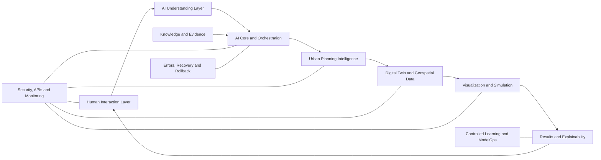
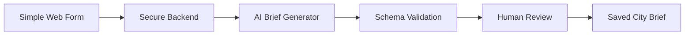

# 04 — System Architecture

**English | [العربية](ar/04-system-architecture.md)**

This document describes the proposed technical and product architecture of AI Future Lab. It explains the responsibility of every major layer, the information exchanged between layers, shared data stores, validation boundaries, failure handling, and the difference between the current concept and a future production system.

---

## 1. Architecture Overview

AI Future Lab is designed as a modular system rather than one large AI model.



The architecture separates responsibilities so that:

- A language model does not pretend to be a GIS engine.
- A visual engine does not decide planning policy.
- A simulation result does not become an approved decision automatically.
- A failed service does not silently corrupt the digital twin.
- A new model can be tested without replacing the complete platform.

---

## 2. Architecture Goals

The system architecture should be:

### Modular

Every layer should have a clear purpose and interface.

### Explainable

Important outputs should preserve evidence, assumptions, tool results, and decision history.

### Safe

High-impact actions should require validation and human approval.

### Traceable

Requirements should connect to planning decisions, digital-twin objects, simulations, and reports.

### Versioned

The project should preserve previous states and support rollback.

### Accessible

The main interface should work through a web browser.

### Scalable

Specialist services should be able to scale independently.

### Bilingual

The interaction layer should eventually support Arabic and English without losing the structured meaning of requirements.

---

# Layer 1 — Human Interaction

## Purpose

Provide a clear environment where users can create, review, edit, and approve city-planning projects.

## Responsibilities

- Text input
- Voice input
- Language selection and detection
- Guided project questionnaire
- File upload
- Site selection
- Clarification conversation
- Project navigation
- Plan comparison
- Feedback and comments
- Approval controls
- Report viewing

## Inputs

- User messages
- Voice recordings
- Uploaded files
- Map selections
- Form values
- Approval or rejection actions

## Outputs

- Normalized user request
- Confirmed values
- Feedback records
- Approval events
- Requested visualizations and reports

## Important user-interface states

- Draft
- Waiting for clarification
- Waiting for data
- Generating candidates
- Validation failed
- Ready for review
- Approved
- Rejected
- Archived

## Safety requirements

- Clearly label AI-generated information.
- Do not present a draft as an approved plan.
- Warn users before uploading confidential information.
- Display assumptions and unresolved questions.
- Require confirmation for important changes.
- Avoid exposing private project data to unauthorized users.

## Possible future web technologies

- Next.js
- TypeScript
- Accessible component library
- MapLibre GL JS for interactive maps
- Secure server-side routes for AI and data services

These technologies are a proposed direction, not a final commitment.

---

# Layer 2 — AI Understanding

## Purpose

Convert natural language and project documents into structured planning information.

## Responsibilities

- Language detection
- Speech-to-text coordination
- Intent extraction
- Entity extraction
- Constraint extraction
- Priority identification
- Ambiguity detection
- Conflict detection
- Missing-information detection
- Clarification-question generation
- Structured city-brief drafting

## Example input

> “I want a family-friendly district for 50,000 people with villas, apartments, schools, clinics, parks, buses, and low water use.”

## Example structured output

```json
{
  "project_type": "family-focused district",
  "population": 50000,
  "housing": ["villas", "apartments"],
  "services": ["schools", "clinics", "parks"],
  "mobility": ["bus network"],
  "sustainability": ["low water demand"],
  "missing": ["site", "area", "housing mix", "development phases"]
}
```

## Validation

- Output must match a schema.
- Numbers must have units where required.
- Confirmed requirements must be separated from assumptions.
- Uncertain extraction should be shown to the user.
- The AI must not invent a site, budget, or regulation.

## Failure modes

- Incorrect voice transcription
- Wrong language detection
- Missing numeric unit
- Confusing a preference with a fixed requirement
- Ignoring a contradiction
- Generating unnecessary clarification questions

## Recovery

The system should return the uncertain field to the user for confirmation instead of continuing silently.

---

# Layer 3 — AI Core and Orchestration

## Purpose

Coordinate the complete planning workflow.

The AI core is not a single chatbot. It is a controller that decides which service should perform each task, checks whether the output is valid, and records the process.

## Responsibilities

- Build task context
- Select models and tools
- Divide large goals into smaller tasks
- Manage task dependencies
- Enforce output schemas
- Collect evidence
- Apply approval rules
- Manage retries and timeouts
- Track cost and latency
- Record decisions
- Prevent unauthorized actions

## Main internal components

### Context builder

Combines:

- Current user request
- Approved city brief
- Project version
- Relevant conversation history
- Retrieved evidence
- Tool results
- User permissions

### Task planner

Creates an ordered list of tasks.

Example:

```text
1. Validate population and site data
2. Estimate service requirements
3. Generate land-use candidates
4. Propose mobility structure
5. Evaluate accessibility
6. Create explanation
```

### Model router

Chooses the correct model for:

- Language understanding
- Summarization
- Structured generation
- Explanation
- Document analysis

### Tool router

Calls specialist services such as:

- GIS operations
- Accessibility calculations
- Policy search
- Database queries
- Simulation services
- Report generation

### Validation manager

Checks:

- Schema validity
- Requirement coverage
- Evidence presence
- Policy rules
- Safety constraints
- Human approval requirements

### Memory manager

Stores useful project context without treating every conversation statement as an approved fact.

## Orchestration principle

```text
AI proposes a task
→ specialist service performs the task
→ validator checks the result
→ evidence is stored
→ approved output updates the next stage
```

## Failure modes

- Tool unavailable
- Model timeout
- Invalid JSON
- Contradictory tool outputs
- Excessive retry loop
- Unauthorized data request
- Cost or latency limit exceeded

## Recovery

- Limited retry
- Fallback model or tool
- Return to previous safe state
- Ask a human for input
- Mark the task incomplete
- Never write unvalidated output into the approved digital twin

---

# Layer 4 — Knowledge and Evidence

## Purpose

Ground recommendations in project-specific and authoritative information.

## Possible sources

- GIS layers
- Site boundaries
- Existing land use
- Topography
- Roads and transport
- Population data
- Climate data
- Planning policies
- Engineering standards
- Environmental restrictions
- Approved project documents
- Previous approved versions

## Main components

### Source registry

Records:

- Source name
- Owner
- Access permission
- Date
- Geographic coverage
- Reliability classification
- Update schedule

### Document processor

Extracts text, tables, metadata, and sections from approved documents.

### Geospatial catalog

Stores references to spatial datasets and coordinate systems.

### Retrieval service

Finds information relevant to the current planning question.

### Evidence ranker

Ranks results by relevance, authority, date, and project applicability.

## Required evidence metadata

```json
{
  "source_id": "policy-001",
  "title": "Planning policy document",
  "publisher": "authorized source",
  "date": "YYYY-MM-DD",
  "section": "relevant section",
  "access_level": "project team",
  "limitations": "example limitation"
}
```

## Safety rules

- Do not mix projects without permission.
- Do not use private documents in public model prompts without authorization.
- Do not present outdated data as current.
- Do not remove source context from a quoted rule.
- Mark an assumption when no reliable source exists.

---

# Layer 5 — Urban Planning Intelligence

## Purpose

Transform an approved city brief into planning candidates and measurable strategies.

## Specialist modules

### Land-use module

- Allocate broad land-use categories
- Check required proportions
- Preserve protected areas
- Connect land use to mobility and services

### District and neighborhood module

- Create district hierarchy
- Define neighborhood centers
- Organize local services
- Support phased growth

### Housing module

- Estimate dwelling requirements
- Represent housing types
- Check population capacity
- Support housing diversity

### Mobility module

- Propose road hierarchy
- Propose public-transport corridors
- Support walking and cycling
- Check network connectivity
- Preserve emergency access

### Public-service module

- Estimate service demand
- Propose school and healthcare locations
- Measure accessibility
- Identify service gaps

### Utilities module

- Store high-level energy, water, waste, and communication requirements
- Estimate demand using explicit assumptions
- Identify where professional engineering models are required

### Sustainability module

- Track green space
- Support heat mitigation
- Estimate resource-demand indicators
- Compare climate-resilience strategies

### Rule and constraint module

- Apply project requirements
- Check known policies
- Identify conflicts
- Mark items requiring professional review

## Candidate-plan output

Each candidate should contain:

- Unique ID and version
- Assumptions
- Land-use strategy
- District structure
- Mobility strategy
- Service strategy
- Sustainability strategy
- Metrics
- Risks
- Validation status
- Evidence links

## Critical limitation

Planning modules may provide early concepts and indicators. They do not replace detailed professional master planning, engineering design, legal review, or government approval.

---

# Layer 6 — Digital Twin and Geospatial Data

## Purpose

Maintain a structured, versioned representation of the proposed city.

## Core concepts

### City object

A digital representation of an element such as a district, road, school, park, or utility asset.

### Relationship

A connection between objects.

Examples:

- School serves neighborhood
- Road connects districts
- Station belongs to transit route
- Park supports heat-mitigation target

### State

The current properties of an object in a specific plan version or scenario.

### Version

A saved project state created after approved changes.

### Scenario

A temporary condition used for testing without changing the approved base plan.

## Suggested data stores

- PostgreSQL
- PostGIS or another spatial extension
- Object storage for documents and images
- Version and audit tables

## Example object structure

```json
{
  "id": "park-022",
  "type": "public_park",
  "name": "Neighborhood Park 4",
  "geometry": "GeoJSON reference",
  "area_m2": 18000,
  "district_id": "district-04",
  "source_requirement": "brief.public_space.local_parks",
  "plan_version": "v0.5",
  "approval_status": "approved",
  "evidence": ["accessibility-test-041"]
}
```

## Versioning rules

- Never overwrite an approved version without history.
- Record who made or approved a change.
- Record why the change occurred.
- Recalculate affected metrics.
- Allow comparison with the previous version.
- Allow controlled rollback.

## Geospatial requirements

- Consistent coordinate reference system
- Geometry validation
- Site-boundary checks
- Spatial indexing
- Clear units
- Data-source metadata

---

# Layer 7 — Visualization

## Purpose

Make project information understandable and interactive.

## Main browser views

- Project dashboard
- Interactive map
- Land-use layers
- District and neighborhood view
- Road and transport view
- Service-accessibility view
- Sustainability indicators
- Scenario controls
- Version comparison
- Decision explanation panel

## Optional future 3D

- Lightweight web-based building extrusion
- Optional Godot connector
- Optional Unity connector
- Optional Unreal Engine connector

3D visualization is not the current core development priority. It should be added only when the structured city data and validation workflow are dependable.

## Visualization rule

A map color or 3D model must be connected to underlying data. A beautiful scene without planning evidence is not a validated result.

---

# Layer 8 — Simulation and Analysis

## Purpose

Evaluate plans under defined scenarios.

## Possible services

- Network accessibility
- Travel-demand approximation
- Service coverage
- Population and housing capacity
- Land-use balance
- Energy-demand estimation
- Water-demand estimation
- Environmental indicators
- Phasing analysis
- Incident scenarios

## Simulation job structure

```json
{
  "scenario_id": "scenario-population-40",
  "base_version": "v0.5",
  "model": "population-service-demand-v1",
  "inputs": {
    "population_change_percent": 40
  },
  "assumptions": ["household-size estimate"],
  "status": "completed",
  "limitations": ["not an engineering capacity model"]
}
```

## Required output information

- Model version
- Input data
- Assumptions
- Result
- Confidence or uncertainty
- Known limitations
- Date
- Reviewer status

## Safety principle

The simpler the model, the more clearly its limitations must be communicated.

---

# Layer 9 — Results and Explainability

## Purpose

Translate project data and simulation outputs into decisions that humans can review.

## Output types

- Executive summary
- Technical report
- KPI dashboard
- Map layers
- Candidate comparison
- Risk register
- Assumption register
- Validation report
- Decision history
- Recommended next actions

## Explanation record

A recommendation should preserve:

- Recommendation
- Requirement supported
- Evidence used
- Tools or models used
- Assumptions
- Alternatives
- Trade-offs
- Uncertainty
- Required reviewer
- Final decision

## Example

```text
Recommendation:
Add a local health center in District 4.

Reason:
The current candidate leaves part of the district outside the target access area.

Evidence:
Accessibility test AT-041 using plan version v0.5.

Assumptions:
Proposed road network and population distribution remain unchanged.

Required review:
Healthcare planner and responsible authority.
```

---

# Layer 10 — Security, APIs and Monitoring

## Purpose

Protect users, project information, system availability, and decision history.

## Responsibilities

- Authentication
- Authorization
- Role-based access
- API gateway
- Input validation
- Rate limits
- Secret management
- Encryption
- Audit logs
- Monitoring
- Alerting
- Threat detection
- Backup verification

## Example roles

- Project viewer
- Project editor
- Planner
- Engineer
- Reviewer
- Approver
- Administrator

## Trust boundaries

- Browser to backend
- Backend to AI provider
- Backend to GIS service
- Backend to document storage
- Internal service to database
- Public data to private project environment

Every boundary requires authorization, input validation, logging, and data-minimization rules.

---

# Layer 11 — Errors, Recovery and Rollback

## Purpose

Prevent a failure from becoming an invisible planning error.

## Error categories

- User-input error
- Data error
- AI-output error
- Tool or service error
- Validation failure
- Security incident
- Database error
- Deployment error

## Recovery process

```text
Detect error
→ classify severity
→ protect current approved state
→ collect logs and evidence
→ retry only when safe
→ use fallback if approved
→ request human intervention when required
→ validate recovery
→ record incident
```

## Safe-state principle

An approved project version must remain available even when a new calculation, model, or deployment fails.

---

# Layer 12 — Controlled Learning and ModelOps

## Purpose

Improve model behavior without allowing uncontrolled self-modification.

## Process

- Collect approved feedback
- Build evaluation datasets
- Test prompts or models in a sandbox
- Compare against the current approved version
- Perform safety and quality review
- Approve limited release
- Monitor production behavior
- Roll back when performance decreases

## Model registry information

- Model name and version
- Provider
- Intended task
- Prompt version
- Evaluation results
- Known limitations
- Approval status
- Release date
- Rollback target

---

## 13. Shared Data Stores

### Project and conversation memory

Stores useful context while separating confirmed facts from conversation history.

### City knowledge base

Stores approved reference material and reusable planning concepts.

### GIS and site database

Stores geospatial information and metadata.

### Digital-twin database

Stores city objects, relationships, versions, and scenarios.

### Simulation-results store

Stores model inputs, outputs, limitations, and review status.

### Decision-evidence store

Connects recommendations to sources and validation results.

### Configuration and version registry

Stores model, prompt, policy, and service versions.

### Audit and security logs

Stores access events, important changes, incidents, and approvals.

### Analytics and learning store

Stores approved performance data for controlled improvement.

---

## 14. Example Request Flow

```text
1. User submits a city idea.
2. Interaction layer normalizes the input.
3. Understanding layer extracts requirements.
4. User answers clarification questions.
5. City brief is approved and versioned.
6. Orchestrator retrieves site data and policies.
7. Planning modules create three candidates.
8. Validation rejects one candidate.
9. Two candidates are simulated and compared.
10. Explainability layer creates a recommendation.
11. Human reviewer approves a revised candidate.
12. Digital twin creates a new approved version.
13. Audit log records every important event.
```

---

## 15. Proposed Deployment Shape

A future implementation could use:

```text
Web application
→ API and authentication layer
→ AI orchestration service
→ planning and validation services
→ geospatial database
→ digital-twin database
→ simulation workers
→ reporting service
→ monitoring and audit systems
```

Possible environments:

- Local development
- Automated testing
- Staging
- Limited pilot
- Production

A feature should not move directly from experimentation to production.

---

## 16. Current Repository vs Future Architecture

### Present in this repository

- Architecture documentation
- Workflow diagrams
- Proposed data flow
- Proposed safety design
- Proposed roadmap
- Small visualization starter code

### Not present as working production services

- Live AI orchestration backend
- Professional GIS database
- Planning optimization service
- Digital-twin database
- Scenario simulation platform
- ModelOps pipeline
- Production security infrastructure

The architecture should therefore be read as a detailed development blueprint and concept, not as evidence that every component is already operating.

---

## 17. First Practical Architecture

The first prototype should be much smaller:



This small architecture would prove the first core capability before maps, simulations, and optional engines are added.
