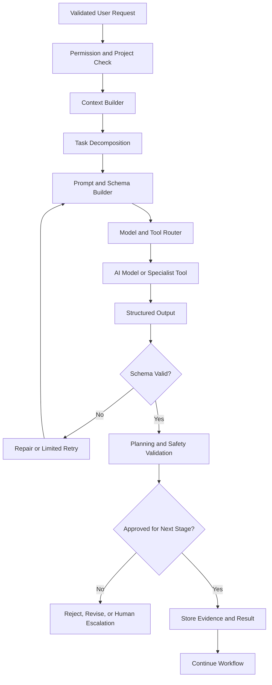
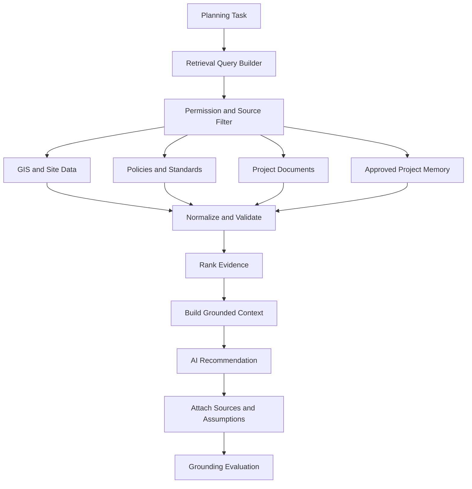
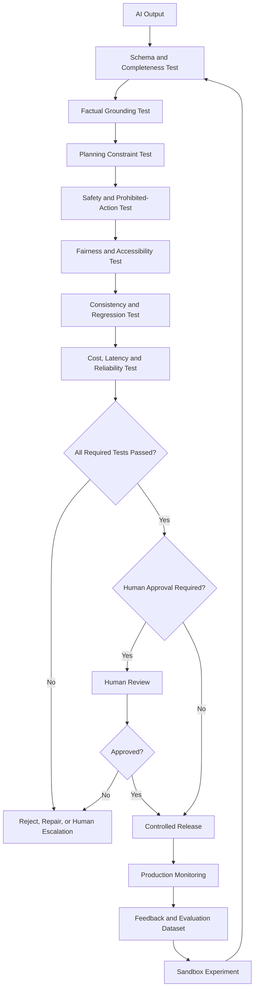
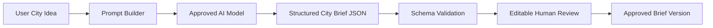

# AI Model Workflows

**English | [العربية](ar/AI_MODEL_WORKFLOWS.md)**

This document explains how artificial intelligence could operate inside AI Future Lab. It expands the main architecture with detailed workflows for model orchestration, prompt construction, tool use, knowledge retrieval, structured output, evaluation, guardrails, monitoring, and controlled improvement.

The workflows describe a proposed production design. A live planning model, RAG database, evaluation platform, and ModelOps system have not yet been implemented in this repository.

---

## 1. Why a Normal Chatbot Is Not Enough

A general chatbot can answer questions and generate ideas, but an urban-planning platform requires stronger controls.

A dependable system must know:

- Which project version is active
- Which requirements are approved
- Which information is only an assumption
- Which data sources are authorized
- Which tool should perform a calculation
- Which output format is required
- Which rule or safety check applies
- Whether human approval is required
- How to recover from an incorrect output

Therefore, AI Future Lab should use an orchestration workflow rather than sending every task directly to one model.

---

# Workflow 12 — AI Model, Prompt, and Tool Orchestration

## High-level flow



---

## 2. Permission and Project Check

Before building a prompt, the system should confirm:

- The user is authenticated.
- The user has access to the project.
- The requested project version exists.
- The user may perform the requested action.
- The data may be sent to the selected model or service.
- The action does not require a higher-level approver.

Example:

A viewer may ask for a summary but should not be able to approve or replace the city brief.

---

## 3. Context Builder

The context builder assembles only the information required for the current task.

Possible context:

- Current user request
- Approved city brief
- Active plan version
- Relevant conversation history
- Approved assumptions
- Retrieved policies or standards
- GIS information
- Previous tool results
- User role
- Output language

## Context rules

- Do not include the complete project when only one section is needed.
- Do not include private information without a valid reason.
- Do not treat unapproved conversation text as a confirmed requirement.
- Preserve source IDs and version IDs.
- Mark missing information clearly.

## Example context package

```json
{
  "task": "identify missing requirements",
  "language": "en",
  "project_version": "brief-v0.3",
  "approved_requirements": {
    "population": 50000,
    "housing": ["villas", "apartments"],
    "services": ["schools", "clinics", "parks"]
  },
  "unknown_fields": ["site_area", "development_phases"],
  "user_role": "project_editor"
}
```

---

## 4. Task Decomposition

Large requests should be divided into smaller tasks.

Example user request:

> “Create and compare sustainable plans for this district.”

Possible task decomposition:

1. Validate city brief completeness.
2. Retrieve relevant site information.
3. Retrieve approved planning rules.
4. Create land-use strategies.
5. Create mobility strategies.
6. Estimate public-service requirements.
7. Combine compatible strategies.
8. Validate each candidate.
9. Calculate comparison metrics.
10. Create explanations.

## Why decomposition matters

- Each task can use the correct tool.
- Errors are easier to identify.
- Results can be validated separately.
- Cost and time are easier to control.
- The system can stop safely when a required input is missing.

---

## 5. Prompt Builder

The prompt builder creates clear task instructions for the selected model.

A strong prompt should define:

- Role and task
- Approved context
- Required output schema
- Prohibited assumptions
- Source-use requirements
- Language
- Validation rules
- What to do when information is missing

## Example prompt structure

```text
SYSTEM PURPOSE:
You are supporting an urban-planning brief workflow.

TASK:
Identify missing or contradictory requirements.

APPROVED CONTEXT:
[structured project fields]

RULES:
- Do not invent values.
- Separate missing information from optional information.
- Return JSON matching the schema.
- Explain every detected conflict.

OUTPUT SCHEMA:
[JSON schema]
```

## Prompt versioning

Each prompt should have:

- Prompt ID
- Version
- Intended task
- Change history
- Evaluation result
- Approval status

---

## 6. Structured Output Schema

AI Future Lab should prefer machine-readable outputs over uncontrolled paragraphs.

Example schema:

```json
{
  "missing_information": [
    {
      "field": "site_area",
      "reason": "Required for density and capacity calculations",
      "priority": "high",
      "question": "What is the approximate site area?"
    }
  ],
  "conflicts": [],
  "assumptions_detected": [],
  "ready_for_brief": false
}
```

## Schema validation checks

- Required fields exist.
- Field types are correct.
- Values are inside allowed ranges.
- IDs refer to existing project objects.
- Units are present.
- No unapproved fields are silently added.

---

## 7. Model Router

Different tasks may require different models.

Possible model categories:

- Language-understanding model
- Structured-output model
- Document-analysis model
- Translation model
- Explanation model
- Vision model for approved maps or diagrams

## Model-selection factors

- Task type
- Required language
- Data sensitivity
- Model accuracy
- Output reliability
- Latency
- Cost
- Context size
- Approved provider list

## Model fallback

Fallback is allowed only when:

- The fallback is approved for the task.
- Data policy allows it.
- Output receives the same validation.
- The fallback event is logged.

---

## 8. Tool Router

The model should call specialist tools for specialist tasks.

Possible tools:

- Database query
- GIS geometry validation
- Network accessibility calculation
- Unit conversion
- Policy-document search
- Service-demand calculator
- Report generator
- File parser

## Tool-call record

```json
{
  "tool": "service_accessibility_v1",
  "input_version": "plan-v0.6",
  "parameters": {
    "service_type": "school",
    "target_minutes": 15
  },
  "status": "completed",
  "output_id": "access-091",
  "limitations": ["conceptual road speeds"]
}
```

## Tool safety rules

- Validate arguments.
- Enforce permissions.
- Apply time and cost limits.
- Record tool version.
- Reject unsupported data.
- Prevent a tool from directly approving a plan.

---

## 9. Retry and Repair

AI outputs may fail because of invalid structure, missing fields, or contradictory content.

Safe retry process:

```text
Invalid output
→ identify validation errors
→ create a repair instruction
→ retry with the same approved context
→ validate again
→ stop after retry limit
→ request human help or mark incomplete
```

The system should not enter an unlimited loop.

## Example retry limits

- JSON-format repair: 1–2 attempts
- Temporary model timeout: limited retry
- Missing project data: no automatic retry; ask the user
- Safety-policy failure: reject and escalate

---

## 10. Planning Validation

A structurally valid output may still be a bad planning output.

Planning validation may check:

- Requirement coverage
- Site-boundary compliance
- Population consistency
- Service presence
- Known policy rules
- Spatial connectivity
- Unsupported claims
- High-risk recommendations

A valid JSON object is not automatically a valid plan.

---

## 11. Evidence Record

Every accepted AI result should store:

- Model and version
- Prompt and version
- Context version
- Tools used
- Sources used
- Structured output
- Validation results
- Human edits
- Final approval status

This record allows reviewers to understand how the result was created.

---

# Workflow 13 — Knowledge Retrieval and RAG

RAG means **Retrieval-Augmented Generation**. The model receives relevant information from approved sources before generating an answer.

## High-level flow



---

## 12. Why Retrieval Is Required

A general model may know broad urban-planning concepts, but it may not know:

- The current site boundary
- Existing roads
- Local service locations
- Current policy version
- Project-specific assumptions
- Confidential project decisions
- Updated climate or population data

Retrieval reduces reliance on general model memory.

---

## 13. Source Types

### GIS and site data

- Boundaries
- Land use
- Roads
- Transport
- Terrain
- Services
- Environmental zones
- Utilities

### Policies and standards

- Planning rules
- Development controls
- Service standards
- Environmental requirements
- Accessibility guidance

### Project documents

- Approved brief
- Previous reports
- Meeting decisions
- Technical studies
- Risk register

### Approved project memory

- Confirmed preferences
- Approved assumptions
- Previous decisions
- Rejected alternatives

### Open data

Only when the source, license, date, and relevance are recorded.

---

## 14. Source Registry

Each source should have metadata.

```json
{
  "source_id": "gis-roads-2026-01",
  "title": "Approved Road Network Dataset",
  "owner": "authorized organization",
  "date": "2026-01-15",
  "coverage": "project site and surrounding area",
  "access": "project team",
  "license": "authorized use",
  "limitations": ["concept design only"]
}
```

---

## 15. Retrieval Query Builder

The query builder converts a planning question into search instructions.

Example task:

> “Check whether all neighborhoods have reasonable access to healthcare.”

Possible retrieval needs:

- Current neighborhood polygons
- Healthcare facility locations
- Road and walking network
- Population distribution
- Approved access target

The system should retrieve only information relevant to the task.

---

## 16. Permission Filtering

Before retrieving information, the system checks:

- User project access
- Source access level
- Allowed model provider
- Allowed use purpose
- Export restrictions

A user with public-view permission should not retrieve confidential infrastructure data.

---

## 17. Data Normalization

Sources may use different:

- File formats
- Coordinate systems
- Units
- Dates
- Names
- Geographic boundaries

Normalization may include:

- Unit conversion
- Coordinate transformation
- Field mapping
- Duplicate removal
- Geometry validation
- Date validation

Changes should be recorded.

---

## 18. Evidence Ranking

Possible ranking factors:

- Authority
- Relevance
- Date
- Geographic match
- Project approval status
- Completeness
- Reliability

A highly relevant but unofficial old document should not automatically outrank a current approved source.

---

## 19. Grounded Context

The model receives concise evidence, not an uncontrolled collection of documents.

Example:

```text
Requirement:
Residents should reach primary healthcare within the approved access target.

Evidence:
- Approved facility dataset, version 2026-01
- Plan version v0.6
- Road network version rn-04

Known limitation:
Walking speeds and future road conditions are conceptual.
```

---

## 20. Grounding Evaluation

After generation, the system checks:

- Does the recommendation cite evidence?
- Does the source support the claim?
- Did the model invent a value?
- Is a source outdated?
- Were assumptions clearly labeled?
- Does the answer exceed the evidence?

If evidence is insufficient, the result should be rejected or marked uncertain.

---

## 21. RAG Failure Cases

- Retrieval returns irrelevant information.
- Policy version is outdated.
- GIS layer uses the wrong coordinate system.
- User lacks permission.
- Source metadata is missing.
- Model misrepresents the source.
- Important evidence is not retrieved.

## Recovery

- Refine query
- Ask for missing data
- Use an approved alternative source
- Request data-steward review
- Mark recommendation incomplete

---

# Workflow 14 — AI Evaluation, Guardrails, and ModelOps

## High-level flow



---

## 22. Evaluation Dimensions

### Requirement coverage

Did the output address the approved request?

### Structured validity

Does the output match the expected schema?

### Factual grounding

Are important claims supported by approved sources?

### Numerical consistency

Do totals, units, and values make sense together?

### Spatial validity

Are geometries valid and inside the correct site?

### Policy compliance

Does the output conflict with known rules?

### Safety

Could the recommendation create obvious public-safety or infrastructure risk?

### Fairness and accessibility

Does the plan distribute access and burden transparently?

### Explainability

Can a reviewer understand the recommendation?

### Consistency

Does the model behave consistently across similar requests and revisions?

### Reliability

Does it recover correctly from timeouts, missing data, and invalid outputs?

### Cost and latency

Can it complete the task within approved limits?

---

## 23. Evaluation Dataset

A future evaluation dataset should contain representative tasks.

Examples:

- Arabic city request with missing site area
- English request with conflicting density goals
- Mixed Arabic–English technical request
- Incorrect population unit
- Outdated policy source
- Unauthorized document
- Missing GIS layer
- Candidate with poor school access
- Recommendation without evidence
- Model timeout

Each example should define expected behavior, not only a preferred final answer.

---

## 24. Guardrails

Guardrails may include:

- Prohibited-action rules
- High-risk review requirement
- Source requirement
- Numeric range checks
- Site-boundary checks
- Sensitive-data filters
- Tool permission rules
- Output schema
- Retry limits
- Cost limits

Guardrails reduce risk but do not guarantee correctness.

---

## 25. Human Review Triggers

Human review should be mandatory when:

- Public safety is affected.
- Critical infrastructure is involved.
- A policy conflict is detected.
- Data is missing or uncertain.
- The system proposes a major project change.
- Different specialist tools disagree.
- A fairness issue appears.
- A model produces an unusual or low-confidence result.

---

## 26. Model Registry

Every model should have a controlled record.

```json
{
  "model_id": "brief-extractor-v2",
  "provider": "approved provider",
  "purpose": "city brief extraction",
  "languages": ["ar", "en"],
  "prompt_version": "brief-prompt-2.1",
  "evaluation_score": "approved benchmark record",
  "known_limitations": ["complex tables", "unclear spoken numbers"],
  "status": "staging",
  "rollback_model": "brief-extractor-v1"
}
```

---

## 27. Release Process

```text
Develop model or prompt change
→ run local tests
→ run evaluation dataset
→ compare with approved version
→ security and privacy review
→ human approval
→ release to staging
→ limited pilot
→ monitor quality and cost
→ approve production or rollback
```

---

## 28. Production Monitoring

Monitor:

- Error rate
- Invalid output rate
- Missing-source rate
- Human correction rate
- Response time
- Cost
- Tool failures
- Safety alerts
- Arabic and English quality
- Difference between versions

Monitoring should protect privacy and avoid storing unnecessary prompt content.

---

## 29. Feedback Processing

Not all feedback should become training data.

Feedback should be checked for:

- Authorization
- Accuracy
- Bias
- Private information
- Project ownership
- Relevance
- Professional review status

Only approved feedback should enter controlled experiments.

---

## 30. Rollback

Rollback may be required when:

- Quality decreases
- Safety failures increase
- Arabic output becomes less accurate
- Costs increase unexpectedly
- A provider changes behavior
- A prompt creates new errors

Rollback should restore:

- Previous model
- Previous prompt
- Previous validation rules
- Previous configuration

The rollback event should be recorded.

---

## 31. Relationship to the Main Architecture

These workflows expand the following layers:

- Human Input and AI Understanding
- AI Core Architecture
- Security, APIs, and Monitoring
- Results and Explainability
- Learning and Optimization
- Deployment and Operations

They do not replace the original workflow boards.

---

## 32. First Real AI Workflow

The first prototype can use a much smaller workflow:



First-prototype guardrails:

- Do not invent missing values.
- Separate assumptions from facts.
- Ask clarification questions.
- Allow full human editing.
- Save draft and approved versions.
- Record model and prompt version.

---

## 33. Honest Project Status

The repository currently documents the workflows and contains no production AI model service.

Not yet implemented:

- Model router
- Tool router
- RAG database
- Source registry
- Automated evaluation service
- Model registry
- Production monitoring
- Controlled model release

The document should be used as a blueprint for future development and professional discussion.
