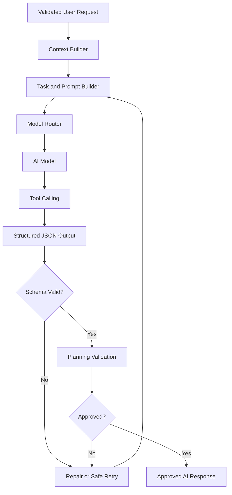
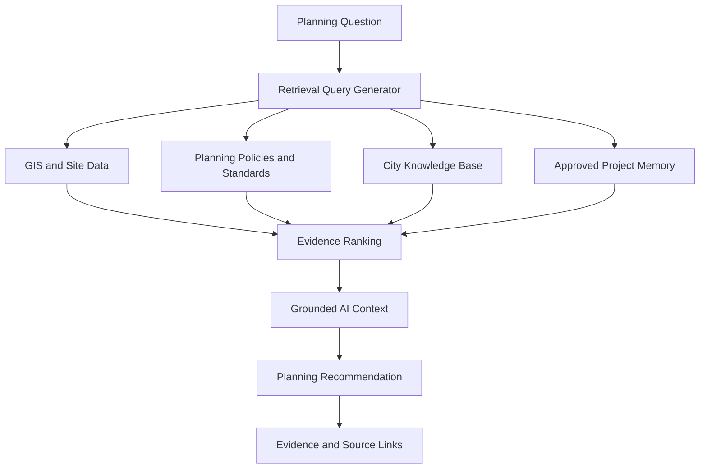
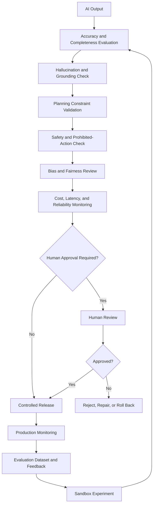

# AI Model Workflows

AI Future Lab requires three additional AI-specific workflows to explain how a reliable planning system would operate.

## 12. AI Model and Prompt Orchestration

### Purpose

This workflow converts a validated city-planning request into a reliable machine-readable response. The context builder combines the current request, approved assumptions, conversation history, project state, retrieved evidence, and tool results.

The model router can select different models or specialist agents for language understanding, planning, geospatial analysis, validation, and explanation. Every output must match a defined schema before it can update the digital twin.

## 13. Knowledge Retrieval and RAG

### Purpose

Retrieval-augmented generation prevents the planning system from relying only on general model knowledge. Relevant site data, GIS layers, regulations, standards, approved assumptions, and precedents are retrieved and ranked before the model produces a recommendation.

The recommendation must preserve links to the evidence used so reviewers can inspect its basis.

## 14. AI Evaluation, Guardrails, and ModelOps

### Evaluation dimensions

- Requirement coverage
- Factual grounding
- Spatial and planning validity
- Policy compliance
- Safety
- Fairness and accessibility
- Explainability
- Consistency across revisions
- Cost and latency
- Reliability and recovery

## Relationship to the Existing Architecture

These workflows do not replace the original eleven boards. They expand the AI Core, Security, Results, Learning, and Deployment layers by showing how model requests are built, grounded, checked, released, monitored, and improved.

## Honest Project Status

These workflows describe the proposed production architecture. A live AI model, RAG database, evaluation service, and ModelOps pipeline have not yet been implemented in this repository.
