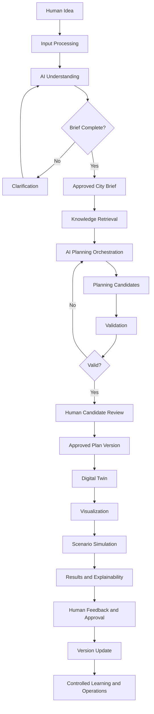
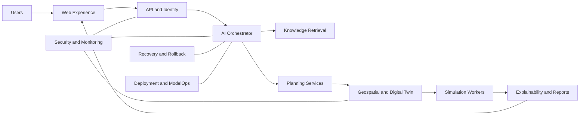
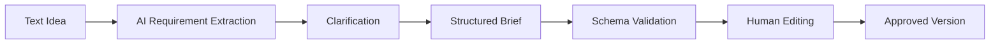

# Complete Workflow Architecture

**English | [العربية](ar/WORKFLOW_ARCHITECTURE.md)**

This document explains how all AI Future Lab workflows connect as one proposed platform. It is the detailed architectural reference for understanding the lifecycle, dependencies, data contracts, approval points, error paths, and shared systems.

The workflows describe a future production architecture. The current repository contains the concept, documentation, visual boards, and starter visualization code—not a completed planning platform.

---

# 1. Complete System Lifecycle



The system begins with a human idea and ends with a human-reviewed project version, not an autonomous final decision.

---

# 2. Shared Status Model

Every important project item should have a status.

Possible statuses:

```text
Draft
Waiting for information
Ready for review
Validation failed
Requires specialist review
Approved
Rejected
Superseded
Archived
```

Status is important because the platform must not confuse a generated draft with an approved planning decision.

---

# 3. Shared Version Model

Important information should be versioned:

- City brief
- Planning candidate
- Digital twin
- Scenario definition
- Simulation model
- Prompt
- AI model
- Policy rule
- Report
- Software release

Example:

```text
Brief v0.1 — Initial AI extraction
Brief v0.2 — User corrected population
Brief v0.3 — Added development phases
Brief v1.0 — Approved by project owner
```

---

# Workflow 1 — Master Overview

## Purpose

Provide one high-level map of the complete platform.

## Input

A human city or district idea.

## Process

The workflow connects all specialist stages without explaining every internal technical operation.

## Output

A complete visual understanding of:

- Where information enters
- How AI understands it
- How planning is created
- How a digital twin is built
- How scenarios are tested
- How results are explained
- Where humans approve
- How the platform is secured and improved

## Value

The master overview helps new readers understand that AI Future Lab is not only:

- A chatbot
- A map
- A simulation
- A game engine
- An AI image generator

It is a connected planning workflow.

## Common failure in interpretation

A reader may assume every box is already working. Public documentation must state that the workflow is a proposed architecture.

---

# Workflow 2 — Human Input and AI Understanding

## Objective

Transform natural human communication into structured, reviewable planning information.

## Entry conditions

- User has permission to create or edit a project.
- The input method is supported.
- Uploaded information is authorized.

## Inputs

- Text request
- Voice request
- Form answers
- Uploaded files
- Site location
- Existing project context

## Processing steps

### 2.1 Capture original request

The original message should be preserved for traceability.

### 2.2 Detect language

The system identifies Arabic, English, or mixed-language input.

### 2.3 Voice transcription

When voice is used:

- Convert to text.
- Show transcription.
- Highlight low-confidence words.
- Allow correction.

### 2.4 Extract intent

Example:

```text
Create a sustainable family district.
```

### 2.5 Extract entities

Possible entities:

- Population
- Area
- Housing
- Roads
- Public transport
- Schools
- Healthcare
- Parks
- Energy
- Water

### 2.6 Extract constraints

Examples:

- Site boundary
- Budget
- Protected land
- Existing infrastructure
- Height limit
- Completion date

### 2.7 Identify priorities

The system records what matters most.

### 2.8 Detect conflicts

Example:

```text
Maximum low density
+ shortest travel distance
+ lowest infrastructure cost
```

### 2.9 Detect missing information

Missing information should be connected to why it matters.

### 2.10 Ask clarification

Questions should be short, necessary, and ordered by importance.

### 2.11 Build city brief

The conversation becomes structured fields.

### 2.12 Human review

The user edits and approves the brief.

## Output contract

```json
{
  "brief_id": "brief-001",
  "version": "v1.0",
  "status": "approved",
  "goals": [],
  "constraints": [],
  "priorities": [],
  "assumptions": [],
  "open_questions": []
}
```

## Validation

- Required fields
- Correct units
- Numeric range
- Confirmation of extracted values
- Separation between facts and assumptions

## Failure path

```text
Extraction uncertainty
→ mark field uncertain
→ ask user
→ receive correction
→ update draft
→ revalidate
```

## Approval owner

Project creator or authorized project editor.

---

# Workflow 3 — AI Core Architecture

## Objective

Coordinate models, tools, memory, rules, evidence, and task execution.

## Entry conditions

- Approved brief exists or the task is clearly allowed during brief creation.
- User has permission.
- Required services are available.

## Inputs

- Task request
- Project version
- Approved brief
- Relevant memory
- Retrieved evidence
- User role

## Core components

### 3.1 Context manager

Builds the minimum relevant context.

### 3.2 Task planner

Divides goals into smaller operations.

### 3.3 Prompt builder

Creates model instructions and output schema.

### 3.4 Model router

Selects the approved model.

### 3.5 Tool router

Selects GIS, database, calculation, or document tools.

### 3.6 Memory manager

Stores project context while protecting approved facts.

### 3.7 Validation manager

Checks structure, evidence, requirements, and safety.

### 3.8 Decision coordinator

Determines whether to continue, retry, reject, or request human review.

### 3.9 Evidence collector

Records sources, tools, assumptions, and results.

### 3.10 Error manager

Classifies and handles failures.

## Task record

```json
{
  "task_id": "task-204",
  "project_version": "brief-v1.0",
  "task_type": "candidate_land_use",
  "model_version": "approved-model-id",
  "tools": ["gis-site-check-v1"],
  "status": "completed",
  "validation": "passed",
  "output_id": "candidate-data-44"
}
```

## Output

A validated, traceable result ready for a specialist planning stage.

## Failure conditions

- Invalid output
- Missing evidence
- Unauthorized request
- Tool timeout
- Model timeout
- Contradictory results
- Retry limit reached

## Failure path

```text
Failure detected
→ protect approved project state
→ classify
→ safe retry or fallback
→ human escalation if required
→ record incident
```

---

# Workflow 4 — Urban Planning and Digital Twin

## Objective

Create planning alternatives and convert the approved choice into a versioned city model.

## Entry conditions

- Approved city brief
- Site data or declared site assumptions
- Required knowledge available

## Inputs

- Brief requirements
- Constraints
- Priorities
- GIS data
- Policies and standards
- Development assumptions

## Planning sequence

### 4.1 Site analysis

Review:

- Boundary
- Existing roads
- Existing services
- Environmental limitations
- Topography where available

### 4.2 Demand profile

Estimate:

- Housing
- Jobs
- Schools
- Healthcare
- Parks
- Mobility
- Utilities

All estimates must show assumptions.

### 4.3 Land-use strategy

Create broad categories and relationships.

### 4.4 District structure

Organize districts, neighborhoods, and centers.

### 4.5 Mobility strategy

Create conceptual:

- Road hierarchy
- Transit corridors
- Walking network
- Cycling network
- Emergency access

### 4.6 Service strategy

Propose schools, healthcare, parks, and community facilities.

### 4.7 Sustainability strategy

Address:

- Energy
- Water
- Waste
- Green space
- Heat
- Resilience

### 4.8 Candidate assembly

Combine compatible strategies into complete candidates.

### 4.9 Validation

Check requirements, rules, capacity assumptions, accessibility, and risk.

### 4.10 Comparison

Compare candidates using consistent metrics.

### 4.11 Human selection

Human reviewers choose, combine, revise, or reject.

### 4.12 Digital-twin creation

The approved candidate becomes versioned city objects.

## Candidate output contract

```json
{
  "candidate_id": "candidate-b",
  "base_brief": "brief-v1.0",
  "strategy": "multi-center",
  "assumptions": [],
  "objects": [],
  "metrics": {},
  "risks": [],
  "validation_status": "requires_review"
}
```

## Digital-twin output contract

```json
{
  "twin_version": "twin-v0.1",
  "source_candidate": "candidate-b",
  "approval_status": "approved",
  "objects": [],
  "relationships": [],
  "metrics": {},
  "history": []
}
```

## Failure conditions

- Candidate violates brief
- Invalid geometry
- Missing service
- Capacity conflict
- Policy conflict
- Unequal service access
- Unsupported calculation

## Approval owners

- Planner
- Relevant specialist
- Authorized approver

---

# Workflow 5 — City Visualization and Simulation

## Objective

Display the digital twin and test controlled scenarios.

## Entry conditions

- Valid digital-twin version
- Scenario definition
- Approved model

## Visualization process

### 5.1 Load project version

The system loads approved city objects and layers.

### 5.2 Display map layers

Examples:

- Land use
- Roads
- Transit
- Services
- Green space
- Utilities
- Environment

### 5.3 Inspect object

The user selects an object and sees:

- Properties
- Source requirement
- Evidence
- Metrics
- Approval status
- History

### 5.4 Compare versions

Show added, removed, moved, or changed objects.

## Simulation process

### 5.5 Define scenario

Example:

```text
Population increases by 30% in phase three.
```

### 5.6 Validate scenario inputs

Check units, ranges, and compatibility.

### 5.7 Run model

Use the approved calculation or simulation service.

### 5.8 Store results

Preserve model version, inputs, assumptions, and limitations.

### 5.9 Compare with base plan

Show changed indicators and risks.

## Scenario output contract

```json
{
  "scenario_id": "growth-30",
  "base_twin": "twin-v0.1",
  "model_version": "population-demand-v1",
  "inputs": {},
  "results": {},
  "limitations": [],
  "review_status": "draft"
}
```

## Optional engines

Godot, Unity, or Unreal Engine may eventually import approved city data for advanced visualization. They are optional future connectors and not the current core platform.

## Failure conditions

- Missing model
- Invalid input
- Model timeout
- Result outside expected range
- Unsupported scenario
- Visualization fails to load

## Safety response

Do not replace the approved digital-twin state. Mark the scenario failed or incomplete.

---

# Workflow 6 — Results and Explainability

## Objective

Create understandable and reviewable outputs.

## Entry conditions

- Valid planning or simulation result
- Evidence available
- Assumptions recorded

## Processing

### 6.1 Select important findings

Identify:

- Strengths
- Weaknesses
- Service gaps
- Risks
- Trade-offs
- Uncertainty

### 6.2 Create KPI summary

Examples:

- Population capacity
- Service access
- Park access
- Land-use area
- Travel indicators
- Resource-demand indicators

### 6.3 Build explanation

Connect recommendation to:

- Requirement
- Evidence
- Tool result
- Assumption
- Alternative

### 6.4 Generate reports

- Executive
- Technical
- Risk
- Assumption
- Validation

### 6.5 Bilingual output

Arabic and English reports should preserve the same values and status.

## Explanation record

```json
{
  "recommendation_id": "rec-08",
  "recommendation": "Add a local clinic",
  "reason": "Service access gap",
  "evidence": ["access-test-20"],
  "assumptions": ["population-distribution-a"],
  "alternatives": ["expand existing clinic"],
  "uncertainty": "moderate",
  "required_reviewer": "healthcare planner"
}
```

## Failure conditions

- Missing evidence
- Hidden assumption
- Translation changes meaning
- Report hides alternative
- Recommendation exceeds model capability

## Approval owner

Reviewer or responsible decision-maker.

---

# Workflow 7 — Errors and Recovery

## Objective

Maintain integrity and recover safely.

## Error types

### User error

- Missing required value
- Unsupported file
- Incorrect unit

### Data error

- Invalid geometry
- Outdated source
- Missing metadata

### AI error

- Invalid JSON
- Hallucinated value
- Unsupported claim

### Tool error

- Timeout
- Service unavailable
- Incompatible output

### Security error

- Unauthorized access
- Exposed secret
- Malicious file

### Deployment error

- Failed release
- Database migration issue

## Severity levels

- Informational
- Low
- Medium
- High
- Critical

## Recovery sequence

```text
Detect
→ classify
→ stop unsafe action
→ protect approved state
→ capture logs
→ retry only if safe
→ fallback if approved
→ human escalation
→ recovery validation
→ incident report
```

## Recovery output

- Incident ID
- Severity
- Affected project or service
- Cause
- Action
- Final status
- Rollback version

---

# Workflow 8 — Security, APIs and Monitoring

## Objective

Protect data, identity, services, and history.

## Security domains

### Identity

- Login
- Session management
- Multi-factor authentication where appropriate

### Authorization

- Project roles
- Object-level permissions
- Approval permissions

### API security

- Authentication
- Input validation
- Rate limits
- Versioning
- Audit logging

### Data security

- Encryption
- Data classification
- Retention
- Backup
- Secure deletion

### Secret management

- API keys
- Database credentials
- Service tokens

### Monitoring

- Availability
- Errors
- Security alerts
- Model failures
- Cost and latency

## Security event flow

```text
Event detected
→ classify
→ block or contain
→ alert
→ investigate
→ recover
→ document
```

## Important rule

Security applies to every workflow, not only one security page.

---

# Workflow 9 — Learning and Controlled Optimization

## Objective

Improve performance without uncontrolled self-learning.

## Approved inputs

- Professional corrections
- Evaluation results
- Repeated clarification failures
- Tool reliability data
- Approved user feedback

## Processing

1. Verify authorization.
2. Remove unnecessary sensitive data.
3. Define improvement hypothesis.
4. Create test dataset.
5. Run sandbox experiment.
6. Compare with current version.
7. Review safety and fairness.
8. Obtain approval.
9. Release to limited users.
10. Monitor.
11. Approve or roll back.

## Output

- New prompt, model, rule, or tool version
- Evaluation report
- Approval record
- Rollback target

## Failure conditions

- Improvement reduces Arabic quality
- Safety regression
- Higher hallucination rate
- Increased cost
- Biased result
- Confidential data included

---

# Workflow 10 — Deployment and Production Operations

## Objective

Move tested software changes into controlled use.

## Environments

```text
Development
→ automated testing
→ staging
→ limited pilot
→ production
```

## Release pipeline

### 10.1 Code review

Check implementation and security.

### 10.2 Automated tests

- Unit
- Integration
- Schema
- Security
- Regression

### 10.3 AI evaluation

Run approved datasets.

### 10.4 Staging deployment

Use test projects and synthetic data.

### 10.5 Human acceptance

Confirm expected behavior.

### 10.6 Controlled production release

Release gradually.

### 10.7 Monitoring

Track quality, errors, cost, and performance.

### 10.8 Rollback

Return to approved stable release when required.

## Operational systems

- Logs
- Metrics
- Alerts
- Backups
- Recovery
- Status page
- Maintenance
- Cost controls

---

# Workflow 11 — Final Integrated Architecture

## Objective

Connect all workflows and shared data stores.

## Integrated service map



## Shared stores

### Project database

Projects, briefs, users, roles, approvals.

### Geospatial database

Boundaries, objects, networks, layers.

### Object storage

Documents, images, exports.

### Evidence store

Sources, quotes, tool results, validation.

### Scenario-results store

Simulation inputs and outputs.

### Model registry

Models, prompts, evaluations, releases.

### Audit store

Access, changes, approvals, incidents.

## Integrated principle

Every output should answer:

- Which project?
- Which version?
- Which requirement?
- Which source?
- Which model or tool?
- Which validation?
- Which human approval?

---

# Workflows 12–14 — AI Model Workflows

Detailed document: [AI Model Workflows](AI_MODEL_WORKFLOWS.md)

These workflows add:

- Context building
- Prompt versioning
- Model routing
- Tool calling
- RAG
- Source ranking
- Grounding checks
- Model evaluation
- Guardrails
- Monitoring
- Controlled release

---

# Cross-Workflow Data Contracts

## City brief contract

Produced by Workflow 2 and consumed by Workflows 3 and 4.

Required characteristics:

- Versioned
- Approved status
- Clear units
- Separate facts and assumptions
- Open questions visible

## Candidate-plan contract

Produced by Workflow 4 and consumed by validation, visualization, and comparison.

Required characteristics:

- Connected to brief version
- Contains assumptions
- Contains metrics
- Contains validation status
- Contains evidence

## Digital-twin contract

Produced by Workflow 4 and consumed by Workflow 5.

Required characteristics:

- Object IDs
- Geometry
- Properties
- Relationships
- Version
- Approval status

## Scenario contract

Produced and consumed by Workflow 5.

Required characteristics:

- Base version
- Changed inputs
- Model version
- Results
- Limitations

## Explanation contract

Produced by Workflow 6.

Required characteristics:

- Recommendation
- Reason
- Evidence
- Assumptions
- Alternatives
- Uncertainty
- Reviewer

---

# Approval Map

```text
City brief → project owner approval
Data source → data steward approval
Planning candidate → planner review
Specialist calculation → specialist review
Digital-twin version → project approver
High-risk recommendation → responsible authority
Model release → model and security approval
Software release → production release approval
```

---

# Example End-to-End Case

## Step 1 — Idea

User requests a sustainable UAE district for 50,000 residents.

## Step 2 — Understanding

AI extracts housing, schools, healthcare, parks, transport, and water goals.

## Step 3 — Clarification

User provides site area, housing mix, and development phases.

## Step 4 — Brief approval

Brief v1.0 is approved.

## Step 5 — Retrieval

The system retrieves approved site and policy information.

## Step 6 — Candidate generation

Three planning strategies are created.

## Step 7 — Validation

One candidate fails service-access requirements.

## Step 8 — Review

Two remaining candidates are compared.

## Step 9 — Selection

The multi-center strategy is selected with transport revisions.

## Step 10 — Digital twin

Twin v0.1 is created.

## Step 11 — Scenario

Population growth of 30% is tested.

## Step 12 — Result

The system identifies school and healthcare capacity risks.

## Step 13 — Explanation

Recommendations include evidence, assumptions, and required reviewers.

## Step 14 — Revision

Twin v0.2 adds new services.

## Step 15 — Approval

Qualified reviewers approve the updated concept version.

---

# Architecture Principles

## Human-centered

Human goals, corrections, and approvals remain central.

## Evidence-based

Recommendations should use inspectable sources and tool results.

## Explainable

Important decisions must be understandable.

## Traceable

Every result connects to a version, input, source, model, and reviewer.

## Safe

Failure should stop unsafe progress and preserve approved state.

## Modular

Services can improve independently.

## Accessible

The main experience should work in a browser.

## Bilingual

Arabic and English should preserve the same project meaning.

## Honest

The system must communicate what is a concept, estimate, simulation, draft, or approval.

---

# Current Implementation Boundary

## Documented today

- Full workflow architecture
- AI model workflows
- Safety principles
- Roadmap
- Feature specification
- Visual boards
- Starter engine code

## Not working as an integrated platform today

- AI orchestration service
- Knowledge retrieval platform
- Planning engine
- Digital twin
- Simulation workers
- Professional report system
- Production security and monitoring

---

# Recommended First Integrated Workflow



This small workflow should be built and tested before the project attempts automatic city generation or advanced engine visualization.
