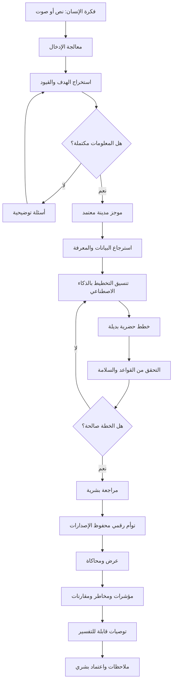

# 03 — كيف يعمل النظام؟

**[English](../03-how-it-works.md) | العربية**

يشرح هذا الملف طريقة عمل AI Future Lab من لحظة إدخال الفكرة حتى مراجعة النتائج وحفظ النسخ.

هذا شرح للهيكل المستقبلي المقترح. المنصة الكاملة غير منفذة حاليًا.

---

## 1. المسار الكامل



---

# المرحلة 1 — إدخال فكرة الإنسان

## الهدف

السماح للمستخدم بشرح فكرته بطريقة طبيعية.

## طرق الإدخال المستقبلية

- نص
- صوت
- استبيان منظم
- ملفات مشروع
- تحديد موقع على الخريطة
- بيانات من مشروع سابق

## مثال

> «خطط لمنطقة مستدامة لـ70 ألف نسمة فيها إسكان متنوع ومدارس ورعاية صحية وحدائق ونقل عام ومسارات دراجات وطاقة متجددة واستهلاك مياه منخفض.»

## المعلومات التي يحاول النظام التقاطها

- اسم المشروع
- الموقع
- مساحة الأرض
- عدد السكان
- مدة التطوير
- الميزانية
- أنواع الإسكان
- الوظائف والتجارة
- المدارس والصحة
- الطرق والنقل
- المشي والدراجات
- الحدائق
- الطاقة والمياه والنفايات
- المناخ والمرونة
- احتياجات المجتمع
- الأولويات

## المخرج

سجل أولي يحفظ الطلب الأصلي وأي ملفات أو موقع اختاره المستخدم.

## التحقق

- هل الإدخال قابل للقراءة؟
- هل الملفات مسموحة؟
- هل المستخدم يملك إذنًا؟
- هل توجد معلومات خاصة غير ضرورية؟
- هل الطلب غير قانوني أو خطير؟

---

# المرحلة 2 — فهم الذكاء الاصطناعي

## الهدف

تحويل الكلام غير المنظم إلى معلومات تخطيطية منظمة.

## اكتشاف اللغة

يتعرف النظام على العربية أو الإنجليزية أو المزج بينهما.

## استخراج الهدف

مثال:

```text
الهدف: إنشاء منطقة مختلطة ومستدامة
```

## استخراج العناصر

```text
السكان: 70,000
الخدمات: مدارس وصحة وحدائق
التنقل: نقل عام ودراجات ومشي
الاستدامة: طاقة متجددة واستهلاك مياه منخفض
```

## استخراج القيود

مثل:

- حدود الموقع
- الميزانية
- منطقة محمية
- طريق قائم
- حد ارتفاع
- موعد نهائي

## استخراج الأولويات

مثال:

```text
1. الوصول إلى النقل العام
2. كفاءة المياه
3. ملاءمة الأحياء للعائلات
4. القدرة التطويرية
```

## اكتشاف التعارض

قد يكتشف النظام أن بعض الأهداف صعبة معًا.

## المخرج

مسودة منظمة تحتوي على:

- حقائق مؤكدة
- افتراضات محتملة
- معلومات ناقصة
- تعارضات
- أسئلة مطلوبة

---

# المرحلة 3 — الأسئلة التوضيحية

## الهدف

حل الغموض قبل بدء التخطيط.

## أمثلة للأسئلة الجيدة

- ما مساحة الموقع؟
- هل النقل العام هو وسيلة التنقل الرئيسية؟
- ما نسبة الفلل إلى الشقق؟
- هل المشروع على مراحل؟
- ما الأولوية الأعلى: كثافة منخفضة أم مسافات أقصر؟
- هل توجد طرق أو مرافق يجب الحفاظ عليها؟

## ما الذي يجب تجنبه؟

- تكرار سؤال تمت الإجابة عنه
- أسئلة لا علاقة لها بالمشروع
- مجموعة كبيرة من الأسئلة التقنية بلا شرح
- طلب بيانات خاصة دون حاجة

## المسار

```text
اكتشاف نقص
→ طرح سؤال
→ استقبال الإجابة
→ تحديث المسودة
→ إعادة التحقق
```

---

# المرحلة 4 — موجز المدينة المعتمد

## الهدف

إنشاء مصدر الحقيقة داخل المشروع.

## الهيكل المقترح

### هوية المشروع

- الاسم
- الموقع
- النسخة
- التاريخ

### الرؤية والأهداف

- الهدف الرئيسي
- المجتمع المستهدف
- النتائج طويلة المدى

### السكان والتطوير

- السكان الحاليون والمستقبليون
- مراحل التطوير
- الإسكان
- الوظائف

### استخدامات الأراضي

- سكني
- تجاري
- عمل
- تعليم
- صحة
- حدائق
- مرافق

### التنقل

- الطرق
- النقل العام
- المشي
- الدراجات
- المواقف
- الطوارئ

### الاستدامة

- الطاقة
- المياه
- النفايات
- المساحات الخضراء
- الحرارة والمناخ

### القيود

- حدود الموقع
- اللوائح
- المناطق المحمية
- الميزانية
- الجدول

### الأمور المفتوحة

- أسئلة لم تُحل
- بيانات مطلوبة
- مراجعات مهنية

## الاعتماد

يعرض النظام جميع الحقول ويطلب الموافقة البشرية قبل الانتقال.

## حفظ الإصدارات

كل تعديل معتمد ينشئ نسخة جديدة ويحفظ النسخ السابقة.

---

# المرحلة 5 — استرجاع البيانات والمعرفة

## الهدف

تزويد الذكاء الاصطناعي بمعلومات خاصة بالمشروع بدل الاعتماد على ذاكرته العامة فقط.

## مصادر محتملة

- حدود الموقع
- التضاريس
- استخدامات الأراضي الحالية
- الطرق والنقل
- المرافق والخدمات
- السكان
- المناخ
- اللوائح
- المعايير
- المستندات المعتمدة

## المسار

```text
سؤال تخطيطي
→ إنشاء استعلام
→ البحث في مصادر معتمدة
→ ترتيب النتائج
→ التحقق من المصدر والتاريخ
→ حفظ الدليل
```

## القواعد

- لا تختلق قانونًا.
- لا تستخدم بيانات قديمة بلا تنبيه.
- افصل البيانات المؤكدة عن الافتراضات.
- احترم الصلاحيات.
- لا ترسل الملفات السرية إلى خدمة غير مصرح بها.

---

# المرحلة 6 — تنسيق التخطيط بالذكاء الاصطناعي

## الهدف

تقسيم المشكلة إلى مهام وإرسال كل مهمة للأداة المناسبة.

## مثال للمهام

1. التحقق من السكان والموقع.
2. تقدير الطلب على الخدمات.
3. إنشاء استراتيجيات استخدامات الأراضي.
4. اقتراح شبكات التنقل.
5. توزيع المدارس والصحة والحدائق.
6. تقدير الطلب الأولي على المرافق.
7. فحص الاستدامة.
8. مقارنة الخطط.

## الأدوات المحتملة

- نموذج لغة
- GIS
- حاسبة وصول للخدمات
- محسن استخدامات الأراضي
- نموذج نقل
- حاسبة الطلب على المرافق
- محرك قواعد
- مولد تقارير

## المبدأ

لا يجب أن يدّعي نموذج اللغة أنه أجرى حسابًا هندسيًا إذا كانت هناك أداة متخصصة مطلوبة.

---

# المرحلة 7 — الخطط البديلة

## الهدف

إنشاء أكثر من استراتيجية.

### الخطة A — تعتمد على النقل العام

كثافة أعلى حول المحطات ومراكز مختلطة.

### الخطة B — مراكز أحياء متعددة

خدمات قريبة من السكان ورحلات محلية أقصر.

### الخطة C — منخفضة الكثافة وخضراء

مساحات مفتوحة أكبر وشبكات مرافق أطول.

كل خطة تشمل:

- استخدامات الأراضي
- هيكل المناطق
- التنقل
- الخدمات
- الاستدامة
- الافتراضات
- المخاطر
- نقاط القوة والضعف

---

# المرحلة 8 — التحقق

## أنواع التحقق

### المتطلبات

هل الخطة تحقق موجز المدينة؟

### المكان

هل العناصر داخل الموقع؟ وهل الشبكات متصلة؟

### السعة

هل افتراضات المدارس والصحة والمرافق مناسبة للسكان؟

### اللوائح

هل يوجد تعارض مع قواعد معروفة؟

### السلامة

هل توجد مشاكل واضحة في الطوارئ أو البنية التحتية؟

### العدالة

هل الخدمات متاحة للأحياء المختلفة؟

### البيانات

هل المصادر صحيحة وحديثة؟

عند الفشل، يجب إظهار:

- القاعدة التي فشلت
- السبب
- الدليل
- درجة الخطورة
- التصحيح المقترح
- هل نحتاج مختصًا؟

---

# المرحلة 9 — المراجعة البشرية

يمكن للمستخدم:

- اعتماد خطة
- رفضها
- دمج أفكار
- تغيير الأولويات
- طلب بديل
- إضافة قيد
- طلب مراجعة مختص

لا يقول النظام:

> «هذه هي الخطة الصحيحة.»

بل يشرح:

> «الخطة A أفضل للنقل العام، بينما الخطة B أفضل للوصول المحلي إلى الخدمات، وكل خيار يحتوي على تنازلات ويحتاج مراجعة بشرية.»

---

# المرحلة 10 — التوأم الرقمي

## الهدف

تحويل الخطة المعتمدة إلى تمثيل رقمي منظم.

## عناصر محتملة

- الموقع
- المنطقة
- الحي
- القطعة
- المبنى
- الطريق
- خط النقل
- المحطة
- المدرسة
- المركز الصحي
- الحديقة
- المرفق

## مثال كائن مدرسة

```json
{
  "id": "school-014",
  "type": "school",
  "capacity": 1200,
  "district": "district-03",
  "plan_version": "v0.4",
  "approval_status": "requires_review"
}
```

## أهمية النسخ

إذا تم نقل المدرسة، يحفظ النظام:

- موقعها السابق
- سبب النقل
- من اعتمد التغيير
- أثر التغيير
- النسخة الجديدة

---

# المرحلة 11 — العرض

الاتجاه الأساسي هو خريطة تفاعلية في المتصفح.

الطبقات المحتملة:

- استخدامات الأراضي
- المناطق
- الطرق
- النقل العام
- المدارس والصحة
- الحدائق
- المرافق
- البيئة
- مراحل التطوير

المحركات ثلاثية الأبعاد اختيارية للمستقبل.

الصورة الجميلة وحدها لا تثبت صحة الخطة.

---

# المرحلة 12 — المحاكاة

## سيناريوهات محتملة

- زيادة السكان
- ارتفاع طلب التنقل
- إضافة خط نقل
- زيادة طلب المدارس والصحة
- نقص المياه أو الطاقة
- موجة حرارة
- إغلاق طريق
- تغيير سياسة

كل نتيجة تعرض:

- النموذج
- المدخلات
- الافتراضات
- مستوى الثقة
- الحدود

النموذج البسيط لا يُعرض كتنبؤ هندسي احترافي.

---

# المرحلة 13 — النتائج والتفسير

المخرجات:

- مؤشرات أداء
- مقارنات
- خرائط
- مخاطر
- سجل افتراضات
- عدم يقين
- توصيات
- تقرير تنفيذي
- تقرير تقني

كل توصية تجيب:

1. ماذا نقترح؟
2. لماذا؟
3. ما المتطلب الذي تدعمه؟
4. ما البيانات؟
5. ما البدائل؟
6. ما التنازلات؟
7. ما عدم اليقين؟
8. من يعتمدها؟

---

# المرحلة 14 — الملاحظات والتعديل

```text
ملاحظة بشرية
→ تحديد العناصر المتأثرة
→ إنشاء مسودة تعديل
→ إعادة الحساب
→ إعادة التحقق
→ مقارنة النسخ
→ طلب الاعتماد
```

---

# المرحلة 15 — التعلم الخاضع للرقابة

لا يتعلم النظام من كل تصرف مباشرة.

```text
ملاحظات معتمدة
→ تحليل
→ تجربة في بيئة اختبار
→ تقييم
→ مراجعة سلامة
→ موافقة بشرية
→ إطلاق محدود
→ مراقبة
→ اعتماد أو رجوع
```

---

# مثال كامل

## الفكرة

منطقة عائلية مستدامة في الإمارات لـ50 ألف نسمة.

## الفهم

- فلل وشقق
- مدارس وعيادات وحدائق
- نقل عام
- استهلاك مياه منخفض

## الأسئلة

- في أي إمارة؟
- ما المساحة؟
- ما نسبة الفلل؟
- هل يوجد إسكان ميسر؟
- ما الطرق الحالية؟
- هل التطوير على مراحل؟

## الخطط

- ممر نقل عام
- مراكز أحياء
- خطة خضراء منخفضة

## المقارنة

- الوصول للخدمات
- البنية التحتية
- الحدائق
- النقل
- الإسكان
- المياه
- التوسع

## القرار

يختار الفريق خطة مراكز الأحياء ويطلب تحسين النقل.

## التعديل

يحدث النظام الشبكة ويعيد الحساب ويحفظ نسخة جديدة.

---

# الحالة الحالية

المسار الكامل غير منفذ تلقائيًا.

أول تطبيق منطقي:

```text
فكرة المستخدم
→ فهم AI
→ أسئلة توضيحية
→ City Brief منظم
→ تعديل واعتماد بشري
```

وبعد نجاحه يمكن إضافة الخريطة والتوأم الرقمي والمحاكاة.
