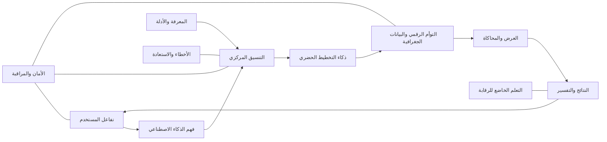
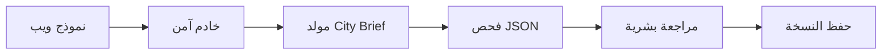

# 04 — هيكل النظام

**[English](../04-system-architecture.md) | العربية**

يشرح هذا الملف الهيكل التقني والوظيفي المقترح لـAI Future Lab، ومسؤولية كل طبقة، والبيانات التي تدخل وتخرج منها، وكيفية التحقق والأمان والاستعادة.

هذا الهيكل هو مخطط تطوير مستقبلي، وليس دليلًا على أن جميع الخدمات تعمل حاليًا.

---

## 1. النظرة العامة

AI Future Lab مصمم كنظام مكوّن من وحدات متعددة، وليس نموذج ذكاء اصطناعي واحدًا يقوم بكل شيء.



تقسيم النظام يمنع:

- نموذج اللغة من ادعاء عمل GIS.
- محرك العرض من اتخاذ قرار تخطيطي.
- نتيجة المحاكاة من التحول إلى اعتماد تلقائي.
- فشل خدمة من إتلاف نسخة معتمدة.
- تغيير نموذج AI من دون اختبار.

---

## 2. أهداف الهيكل

### مقسم إلى وحدات

كل جزء له وظيفة وواجهة واضحة.

### قابل للتفسير

يتم حفظ الأدلة والافتراضات والأدوات المستخدمة.

### آمن

العمليات المهمة تمر بالتحقق والموافقة البشرية.

### قابل للتتبع

ترتبط المتطلبات بالقرارات وكائنات المدينة والتقارير.

### محفوظ الإصدارات

يمكن مقارنة النسخ والرجوع إلى نسخة مستقرة.

### سهل الوصول

الاتجاه الأساسي هو تطبيق ويب.

### قابل للتوسع

كل خدمة تتوسع حسب احتياجها.

### ثنائي اللغة

يدعم العربية والإنجليزية مع الحفاظ على المعنى.

---

# الطبقة 1 — تفاعل المستخدم

## الهدف

توفير مكان لإنشاء المشروع ومراجعته وتعديله واعتماده.

## المسؤوليات

- إدخال نص
- إدخال صوت
- اختيار اللغة
- استبيان للمشروع
- رفع الملفات
- تحديد الموقع
- الأسئلة التوضيحية
- مقارنة الخطط
- الملاحظات
- الموافقات
- عرض التقارير

## المدخلات

- رسائل المستخدم
- تسجيلات صوت
- ملفات
- اختيارات الخريطة
- بيانات النماذج
- الموافقة أو الرفض

## المخرجات

- طلب منظم
- قيم مؤكدة
- ملاحظات
- أحداث اعتماد
- طلبات عرض وتقارير

## حالات الشاشة

- مسودة
- ينتظر معلومات
- جاري التوليد
- فشل التحقق
- جاهز للمراجعة
- معتمد
- مرفوض
- مؤرشف

## الأمان

- وضع علامة واضحة على مخرجات AI.
- عدم عرض المسودة كخطة معتمدة.
- تحذير المستخدم من رفع معلومات سرية.
- إظهار الافتراضات والأسئلة المفتوحة.
- طلب التأكيد للتغييرات المهمة.

---

# الطبقة 2 — فهم الذكاء الاصطناعي

## الهدف

تحويل اللغة الطبيعية والملفات إلى معلومات تخطيطية منظمة.

## المسؤوليات

- اكتشاف اللغة
- تنسيق تحويل الصوت إلى نص
- استخراج الهدف
- استخراج العناصر
- استخراج القيود
- تحديد الأولويات
- اكتشاف الغموض
- اكتشاف التعارض
- اكتشاف النواقص
- إنشاء الأسئلة
- صياغة City Brief

## مثال مدخل

> «أريد منطقة عائلية لـ50 ألف نسمة فيها فلل وشقق ومدارس وعيادات وحدائق وحافلات واستهلاك مياه منخفض.»

## مثال مخرج

```json
{
  "project_type": "family district",
  "population": 50000,
  "housing": ["villas", "apartments"],
  "services": ["schools", "clinics", "parks"],
  "missing": ["site", "area", "development phases"]
}
```

## التحقق

- مطابقة بنية JSON
- وجود الوحدات
- فصل الحقيقة عن الافتراض
- عرض القيم غير المؤكدة
- عدم اختراع موقع أو ميزانية أو قانون

## الأخطاء المحتملة

- خطأ في تفريغ الصوت
- خطأ في الرقم
- عدم فهم الوحدة
- اعتبار تفضيل قيدًا ثابتًا
- تجاهل التعارض

## الاستعادة

يتم سؤال المستخدم بدل الاستمرار بصمت.

---

# الطبقة 3 — النواة والتنسيق

## الهدف

تنسيق النماذج والأدوات والذاكرة والقواعد والأدلة.

## المسؤوليات

- بناء السياق
- اختيار النموذج
- تقسيم المهام
- اختيار الأدوات
- فرض بنية المخرجات
- جمع الأدلة
- تطبيق قواعد الموافقة
- إدارة إعادة المحاولة
- تسجيل القرارات
- منع العمليات غير المصرح بها

## المكونات

### باني السياق

يجمع الطلب الحالي والموجز المعتمد والنسخة والأدلة والصلاحيات.

### مخطط المهام

يقسم العمل إلى خطوات.

### موجه النماذج

يختار النموذج المناسب لفهم اللغة أو التلخيص أو التفسير.

### موجه الأدوات

يستدعي GIS أو قاعدة البيانات أو الحاسبات.

### مدير التحقق

يفحص البنية والمتطلبات والأدلة والسلامة.

### مدير الذاكرة

يحفظ سياق المشروع من دون اعتبار كل كلام حقيقة معتمدة.

### مدير الأخطاء

يصنف الفشل ويقرر إعادة المحاولة أو التصعيد.

## المبدأ

```text
AI يقترح المهمة
→ أداة متخصصة تنفذ
→ التحقق يفحص
→ الدليل يُحفظ
→ المخرج المعتمد ينتقل
```

## الأخطاء

- تعطل أداة
- انتهاء وقت النموذج
- JSON غير صحيح
- تعارض نتائج
- طلب بيانات غير مصرح
- تجاوز التكلفة أو الوقت

## الاستعادة

- إعادة محاولة محدودة
- نموذج بديل معتمد
- رجوع إلى حالة آمنة
- طلب تدخل بشري
- عدم إدخال نتيجة غير محققة إلى التوأم الرقمي

---

# الطبقة 4 — المعرفة والأدلة

## الهدف

ربط التوصيات بمعلومات خاصة بالمشروع ومصادر موثوقة.

## المصادر

- GIS
- حدود الموقع
- استخدامات الأراضي
- الطرق والنقل
- السكان
- المناخ
- اللوائح
- المعايير
- المستندات المعتمدة
- النسخ السابقة

## المكونات

### سجل المصادر

يحفظ الاسم والمالك والتاريخ والصلاحية والحدود.

### معالج المستندات

يستخرج النص والجداول والبيانات الوصفية.

### كتالوج GIS

يحفظ الطبقات ونظام الإحداثيات.

### خدمة البحث

تجلب المعلومات المناسبة للمهمة.

### ترتيب الأدلة

يرتب النتائج حسب الصلة والموثوقية والتاريخ.

## القواعد

- عدم خلط المشاريع.
- عدم إرسال ملفات خاصة لخدمة خارجية بلا إذن.
- عدم استخدام بيانات قديمة بلا تحذير.
- توضيح الافتراض عند غياب المصدر.

---

# الطبقة 5 — ذكاء التخطيط الحضري

## الهدف

تحويل الموجز المعتمد إلى استراتيجيات قابلة للمقارنة.

## الوحدات

### استخدامات الأراضي

توزيع الفئات وربطها بالنقل والخدمات.

### المناطق والأحياء

إنشاء هيكل للأحياء والمراكز.

### الإسكان

تقدير عدد الوحدات والأنواع والمراحل.

### التنقل

اقتراح هيكل الطرق والنقل والمشي والدراجات.

### الخدمات

تقدير الطلب على المدارس والصحة والحدائق.

### المرافق

تسجيل احتياجات الطاقة والمياه والنفايات والاتصالات.

### الاستدامة

المساحات الخضراء والحرارة والموارد والمرونة.

### القواعد والقيود

فحص الموجز والسياسات والمراجعات المطلوبة.

## مخرج الخطة

- معرف ونسخة
- افتراضات
- استخدامات أراضٍ
- مناطق
- تنقل
- خدمات
- استدامة
- مؤشرات
- مخاطر
- حالة التحقق
- روابط الأدلة

## الحد

هذه أفكار ومؤشرات أولية وليست بديلًا للتصميم والهندسة والاعتماد الرسمي.

---

# الطبقة 6 — التوأم الرقمي والبيانات الجغرافية

## الهدف

حفظ تمثيل منظم ومؤرشف للمدينة.

## المفاهيم

### كائن المدينة

منطقة أو طريق أو مدرسة أو حديقة أو مرفق.

### العلاقة

مثل: مدرسة تخدم حيًا، أو طريق يربط منطقتين.

### الحالة

خصائص العنصر في نسخة أو سيناريو.

### النسخة

حالة محفوظة بعد تغيير معتمد.

### السيناريو

تغيير مؤقت للاختبار دون تغيير الخطة الأساسية.

## قواعد النسخ

- لا يتم استبدال نسخة معتمدة بلا تاريخ.
- تسجيل من غير واعتمد.
- تسجيل السبب.
- إعادة حساب المؤشرات المتأثرة.
- مقارنة النسخ.
- دعم الرجوع.

## متطلبات GIS

- نظام إحداثيات واضح
- هندسة صالحة
- فحص الحدود
- وحدات واضحة
- مصدر وتاريخ

---

# الطبقة 7 — العرض

## الهدف

جعل المشروع مفهومًا وتفاعليًا.

## الشاشات

- لوحة المشروع
- خريطة تفاعلية
- استخدامات الأراضي
- الطرق والنقل
- تغطية الخدمات
- الاستدامة
- السيناريوهات
- مقارنة النسخ
- لوحة تفسير القرار

## العرض ثلاثي الأبعاد

اختياري للمستقبل:

- Web 3D
- Godot
- Unity
- Unreal

لا يكون أولوية قبل استقرار بيانات المدينة.

---

# الطبقة 8 — المحاكاة والتحليل

## الهدف

اختبار الخطط تحت شروط محددة.

## خدمات محتملة

- الوصول عبر الشبكة
- طلب التنقل
- تغطية الخدمات
- السعة السكانية
- توازن استخدامات الأراضي
- الطاقة والمياه
- البيئة
- مراحل التطوير
- الحوادث

## كل نتيجة تعرض

- نسخة النموذج
- المدخلات
- الافتراضات
- النتيجة
- عدم اليقين
- الحدود
- حالة المراجعة

كلما كان النموذج أبسط، وجب توضيح حدوده أكثر.

---

# الطبقة 9 — النتائج والتفسير

## الهدف

تحويل البيانات إلى قرارات يمكن للإنسان مراجعتها.

## المخرجات

- ملخص تنفيذي
- تقرير تقني
- مؤشرات
- خرائط
- مقارنة خطط
- مخاطر
- افتراضات
- تاريخ القرار

## سجل التوصية

يحفظ:

- التوصية
- المتطلب
- الدليل
- الأداة
- الافتراضات
- البدائل
- التنازلات
- عدم اليقين
- المراجع
- القرار النهائي

---

# الطبقة 10 — الأمان وAPI والمراقبة

## المسؤوليات

- تسجيل الدخول
- الصلاحيات
- API Gateway
- التحقق من المدخلات
- تحديد الطلبات
- إدارة الأسرار
- التشفير
- سجلات التدقيق
- المراقبة
- التنبيهات
- النسخ الاحتياطي

## الأدوار

- مشاهد
- محرر
- مخطط
- مهندس
- مراجع
- معتمد
- مدير

## حدود الثقة

- المتصفح والخادم
- الخادم وخدمة AI
- الخادم وGIS
- الخدمات وقاعدة البيانات

كل حد يحتاج صلاحيات وتحققًا وتسجيلًا.

---

# الطبقة 11 — الأخطاء والاستعادة

## أنواع الأخطاء

- إدخال مستخدم
- بيانات
- AI
- خدمة
- تحقق
- أمان
- قاعدة بيانات
- نشر

## المسار

```text
اكتشاف
→ تصنيف
→ حماية النسخة المعتمدة
→ جمع السجلات
→ إعادة محاولة آمنة
→ بديل معتمد
→ تصعيد بشري
→ اختبار الاستعادة
→ تسجيل الحادث
```

---

# الطبقة 12 — التعلم وModelOps

## الهدف

تحسين النظام دون تعديل غير خاضع للرقابة.

- جمع ملاحظات معتمدة
- بناء اختبارات
- تجربة النماذج والتعليمات
- مقارنة النسخ
- مراجعة السلامة
- إطلاق محدود
- مراقبة
- اعتماد أو رجوع

## سجل النموذج

- الاسم والنسخة
- المزود
- المهمة
- نسخة التعليمات
- نتائج الاختبارات
- الحدود
- حالة الاعتماد
- نسخة الرجوع

---

## 13. مخازن البيانات المشتركة

- ذاكرة المشروع والمحادثة
- قاعدة معرفة المدينة
- GIS والموقع
- التوأم الرقمي
- نتائج المحاكاة
- أدلة القرارات
- سجل النماذج والإعدادات
- سجلات الأمان
- بيانات التقييم والتعلم

---

## 14. مثال لتدفق الطلب

```text
1. يدخل المستخدم الفكرة.
2. يستخرج النظام المتطلبات.
3. يجيب المستخدم عن الأسئلة.
4. يعتمد الموجز.
5. يسترجع النظام البيانات.
6. ينشئ ثلاث خطط.
7. يرفض التحقق خطة واحدة.
8. تتم مقارنة خطتين.
9. يختار الإنسان خطة معدلة.
10. ينشأ توأم رقمي.
11. يتم اختبار سيناريو.
12. تُنتج توصية مع دليل.
13. يحفظ سجل القرار.
```

---

## 15. شكل النشر المستقبلي

```text
تطبيق ويب
→ API وهوية
→ منسق AI
→ خدمات تخطيط
→ قاعدة GIS
→ قاعدة التوأم الرقمي
→ عمال المحاكاة
→ التقارير
→ المراقبة والتدقيق
```

بيئات العمل:

- تطوير
- اختبار
- Staging
- Pilot محدود
- Production

---

## 16. الموجود وغير الموجود

### الموجود

- التوثيق
- الـworkflows
- تدفق البيانات المقترح
- تصميم الأمان
- خارطة الطريق
- أكواد عرض أولية

### غير الموجود كخدمات تعمل

- Backend AI
- GIS احترافي
- محرك تخطيط
- قاعدة توأم رقمي
- محاكاة
- ModelOps
- أمان إنتاجي

---

## 17. أول هيكل عملي



هذا هو الهيكل الأنسب لأول نموذج قبل الخريطة والمحاكاة والمحركات.
