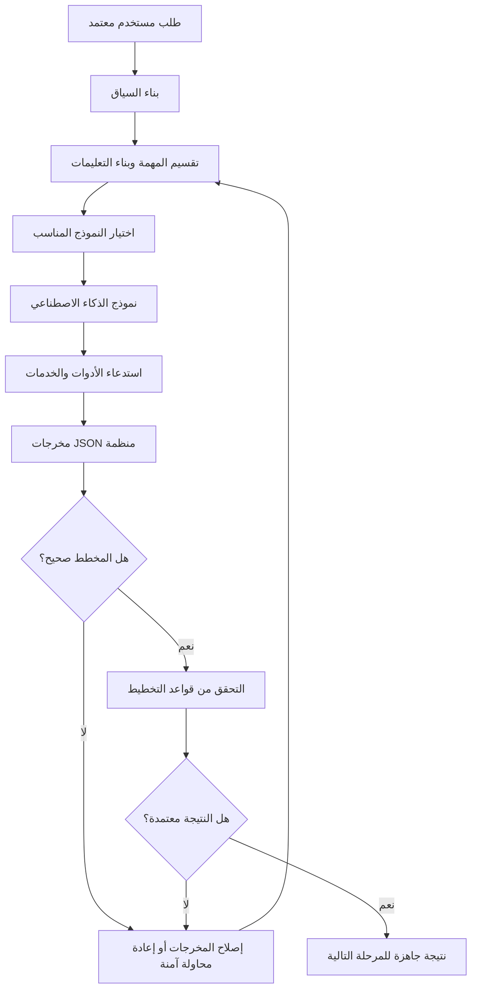
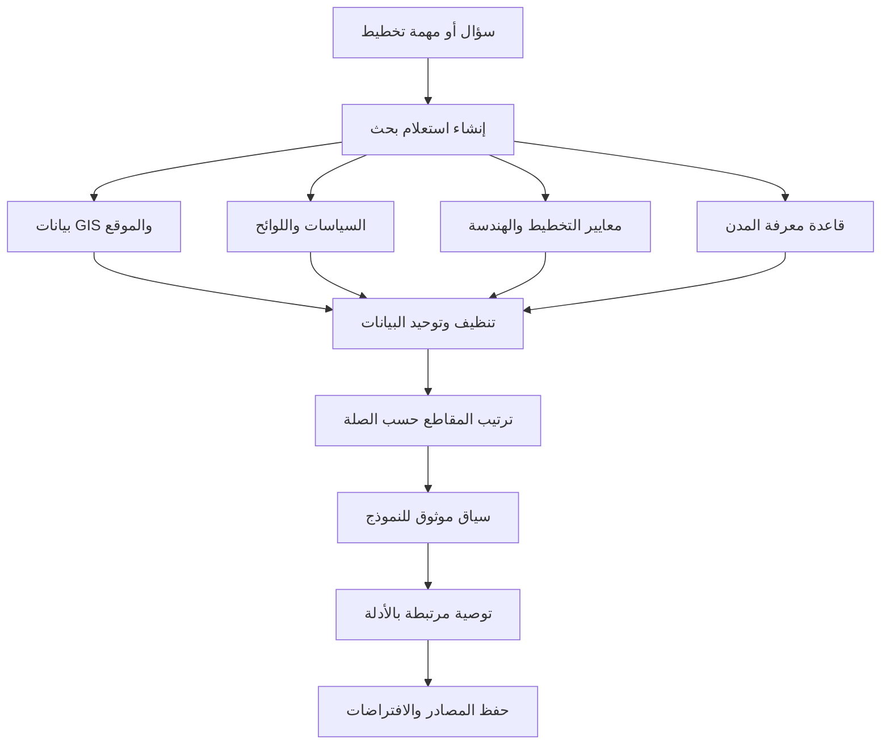
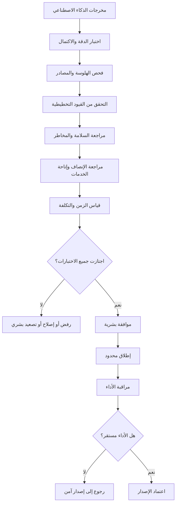

# مسارات عمل نماذج الذكاء الاصطناعي

**[English](../AI_MODEL_WORKFLOWS.md) | العربية**

يحتاج AI Future Lab إلى مسارات عمل واضحة تبين كيف يفهم الذكاء الاصطناعي الطلب، وكيف يستعين بالبيانات والأدوات، وكيف يتم التحقق من نتائجه قبل اعتمادها.

## 12. تنسيق النموذج والتعليمات والأدوات

### المسؤوليات

- جمع طلب المستخدم والنسخة المعتمدة من موجز المدينة.
- إضافة السياق السابق والافتراضات والقيود.
- تقسيم المهمة إلى خطوات صغيرة قابلة للتحقق.
- اختيار النموذج أو الأداة المناسبة لكل مهمة.
- إلزام النموذج بإخراج منظم بدل النص غير المنضبط.
- التحقق من الحقول والأنواع والقيم المطلوبة.
- إعادة المحاولة بطريقة محدودة وآمنة عند الفشل.
- تسجيل سبب اختيار النموذج والأدوات والنتيجة.

## 13. استرجاع المعرفة وRAG

لا يجب أن يعتمد النظام على ذاكرة النموذج وحدها. يحتاج إلى استرجاع معلومات مرتبطة بالموقع والمشروع قبل تقديم توصية.

### مصادر المعرفة المحتملة

- بيانات الموقع والطبوغرافيا.
- الحدود والقطع واستخدامات الأراضي.
- شبكات الطرق والنقل.
- مواقع الخدمات والبنية التحتية.
- لوائح التخطيط والاشتراطات.
- أهداف الاستدامة والطاقة والمياه.
- الدراسات والبيانات المفتوحة المعتمدة.
- بيانات المشروع التي يرفعها المستخدم بإذن واضح.

### قواعد مهمة

- عرض مصدر كل معلومة رئيسية.
- التمييز بين البيانات المؤكدة والافتراضات.
- عدم استخدام بيانات قديمة دون تنبيه.
- عدم استخدام بيانات شخصية أو سرية دون صلاحية.
- عدم اختراع لوائح أو أرقام غير موجودة في المصادر.

## 14. التقييم والحواجز الوقائية وModelOps

### ما الذي يتم تقييمه؟

- الالتزام بموجز المدينة.
- صحة البنية المنظمة للمخرجات.
- وجود أدلة للمعلومات المهمة.
- التناقضات والافتراضات غير المعلنة.
- أثر الخطة على الأحياء والفئات المختلفة.
- الوصول إلى المدارس والصحة والنقل والمساحات العامة.
- مخاطر السلامة والطوارئ والبنية التحتية.
- سرعة الاستجابة والتكلفة التشغيلية.
- أداء كل إصدار من النموذج مقارنة بالإصدار السابق.

### الحوكمة البشرية

الذكاء الاصطناعي يقدم دعمًا للقرار ولا يمنح موافقة قانونية أو هندسية. أي خطة مؤثرة في السلامة العامة أو البنية التحتية أو البيئة تحتاج إلى مراجعة واعتماد من مختصين وجهات مسؤولة.

## السجل والتتبع

يجب أن يسجل النظام لكل نتيجة:

- إصدار النموذج.
- نسخة التعليمات.
- الأدوات المستخدمة.
- مصادر المعرفة.
- الافتراضات.
- نتائج الاختبارات.
- التعديلات البشرية.
- القرار النهائي.
- سبب الرجوع إلى إصدار سابق عند حدوثه.

بهذا يصبح النظام قابلاً للتفسير والمراجعة والتحسين بدل أن يكون صندوقًا أسود.