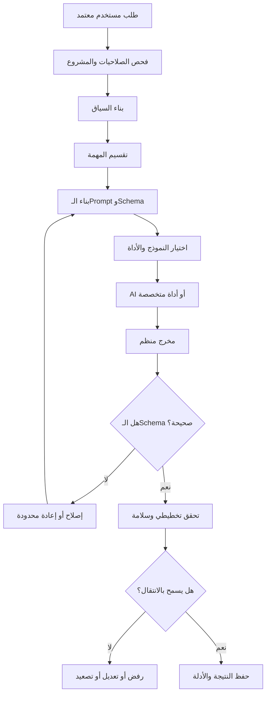
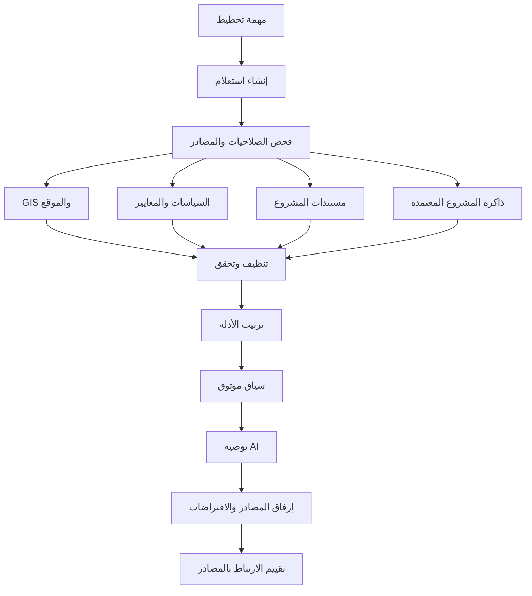
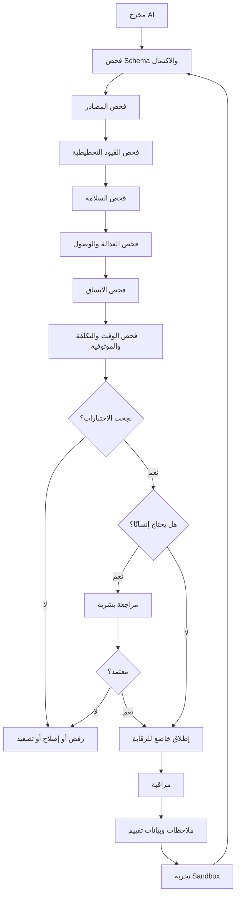
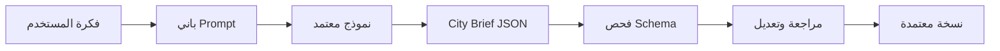

# مسارات عمل نماذج الذكاء الاصطناعي

**[English](../AI_MODEL_WORKFLOWS.md) | العربية**

يشرح هذا الملف كيف يمكن للذكاء الاصطناعي أن يعمل داخل AI Future Lab بطريقة منظمة وآمنة، من بناء السياق والتعليمات إلى اختيار النموذج والأدوات، واسترجاع المصادر، والتحقق، والمراقبة، والتحسين الخاضع للرقابة.

هذه هندسة إنتاجية مقترحة. لا توجد حاليًا خدمة AI تخطيطية حية أو RAG أو ModelOps كامل داخل المستودع.

---

## 1. لماذا لا يكفي Chatbot عادي؟

يمكن للشات بوت العام كتابة أفكار، لكن منصة تخطيط تحتاج أن تعرف:

- أي نسخة من المشروع نشطة
- ما المتطلبات المعتمدة
- ما الافتراضات
- ما المصادر المسموحة
- ما الأداة المناسبة للحساب
- ما شكل المخرج المطلوب
- ما قواعد السلامة
- متى نحتاج إنسانًا
- كيف نرجع عند الخطأ

لذلك يحتاج المشروع إلى منسق وليس طلبًا مباشرًا واحدًا لنموذج لغة.

---

# Workflow 12 — تنسيق النموذج والـPrompt والأدوات



---

## 2. فحص الصلاحية والمشروع

قبل إرسال طلب إلى النموذج، يتأكد النظام من:

- تسجيل دخول المستخدم
- وصوله للمشروع
- وجود النسخة المطلوبة
- السماح له بالعملية
- السماح بإرسال البيانات للخدمة
- عدم الحاجة إلى معتمد أعلى

المشاهد يستطيع القراءة، لكنه لا يستطيع اعتماد City Brief.

---

## 3. باني السياق

يجمع فقط المعلومات المطلوبة للمهمة:

- طلب المستخدم
- City Brief المعتمد
- نسخة الخطة
- جزء المحادثة المناسب
- الافتراضات المعتمدة
- المصادر المسترجعة
- نتائج الأدوات
- دور المستخدم
- لغة المخرج

## القواعد

- عدم إرسال المشروع كاملًا بلا حاجة.
- عدم تضمين معلومات خاصة.
- عدم اعتبار كل كلام سابق حقيقة.
- حفظ معرفات المصادر والنسخ.
- توضيح البيانات الناقصة.

## مثال

```json
{
  "task": "identify_missing_requirements",
  "language": "ar",
  "project_version": "brief-v0.3",
  "approved_requirements": {
    "population": 50000,
    "housing": ["villas", "apartments"]
  },
  "unknown_fields": ["site_area", "development_phases"],
  "user_role": "project_editor"
}
```

---

## 4. تقسيم المهمة

الطلب الكبير يُقسم إلى أجزاء.

مثال:

> «أنشئ وقارن خططًا مستدامة.»

يصبح:

1. التحقق من الموجز.
2. استرجاع الموقع.
3. استرجاع اللوائح.
4. إنشاء استراتيجيات الأراضي.
5. إنشاء التنقل.
6. تقدير الخدمات.
7. دمج الاستراتيجيات.
8. التحقق.
9. حساب المؤشرات.
10. إنشاء التفسير.

الفائدة:

- اختيار أداة صحيحة لكل جزء
- اكتشاف الأخطاء بسهولة
- التحكم بالوقت والتكلفة
- التوقف عند نقص معلومة

---

## 5. باني الـPrompt

يحدد:

- دور النموذج
- المهمة
- السياق المعتمد
- شكل JSON
- الأشياء الممنوعة
- ضرورة المصادر
- اللغة
- قواعد التعامل مع النقص

مثال:

```text
الهدف:
اكتشاف المتطلبات الناقصة أو المتعارضة.

القواعد:
- لا تختلق أرقامًا.
- افصل الناقص عن الاختياري.
- أعد JSON فقط.
- اشرح كل تعارض.
```

كل Prompt له:

- معرف
- نسخة
- مهمة
- سجل تغييرات
- نتيجة تقييم
- حالة اعتماد

---

## 6. المخرجات المنظمة

يفضل النظام JSON بدل فقرة حرة.

```json
{
  "missing_information": [
    {
      "field": "site_area",
      "reason": "مطلوبة لحساب الكثافة والسعة",
      "priority": "high",
      "question": "ما مساحة الموقع التقريبية؟"
    }
  ],
  "conflicts": [],
  "assumptions_detected": [],
  "ready_for_brief": false
}
```

## فحص الـSchema

- وجود الحقول
- صحة الأنواع
- النطاقات
- صحة المعرفات
- الوحدات
- عدم إضافة حقائق غير معتمدة

---

## 7. موجه النماذج

يمكن اختيار نموذج حسب:

- نوع المهمة
- اللغة
- حساسية البيانات
- الدقة
- ثبات JSON
- السرعة
- التكلفة
- حجم السياق
- قائمة المزودين المعتمدين

نماذج محتملة:

- فهم اللغة
- المخرجات المنظمة
- تحليل المستندات
- الترجمة
- التفسير
- الرؤية للصور المعتمدة

## البديل

يستخدم فقط إذا:

- معتمد للمهمة
- سياسة البيانات تسمح
- يمر بالتحقق نفسه
- يتم تسجيل التحويل

---

## 8. موجه الأدوات

أمثلة الأدوات:

- قاعدة البيانات
- GIS
- حساب الوصول
- تحويل الوحدات
- البحث في اللوائح
- حساب الطلب على الخدمات
- التقارير
- قراءة الملفات

## سجل استدعاء أداة

```json
{
  "tool": "service_accessibility_v1",
  "input_version": "plan-v0.6",
  "parameters": {
    "service_type": "school",
    "target_minutes": 15
  },
  "status": "completed",
  "output_id": "access-091",
  "limitations": ["سرعات الطرق افتراضية"]
}
```

## السلامة

- فحص المدخلات
- فحص الصلاحيات
- وقت وتكلفة محددان
- تسجيل النسخة
- رفض البيانات غير المدعومة
- عدم اعتماد الخطة بواسطة الأداة

---

## 9. الإصلاح وإعادة المحاولة

```text
مخرج غير صالح
→ تحديد الخطأ
→ تعليمات إصلاح
→ إعادة بالسياق نفسه
→ تحقق
→ توقف عند الحد
→ تدخل بشري أو حالة غير مكتملة
```

أمثلة:

- إصلاح JSON: محاولة أو محاولتان
- Timeout مؤقت: إعادة محدودة
- بيانات ناقصة: سؤال المستخدم، لا إعادة
- فشل سلامة: رفض وتصعيد

---

## 10. التحقق التخطيطي

JSON صحيح لا يعني أن الخطة صحيحة.

يتم فحص:

- تغطية المتطلبات
- حدود الموقع
- اتساق السكان
- وجود الخدمات
- القواعد
- الاتصال المكاني
- الادعاءات غير المدعومة
- القرارات عالية الخطورة

---

## 11. سجل الأدلة

كل نتيجة مقبولة تسجل:

- النموذج والنسخة
- Prompt والنسخة
- نسخة السياق
- الأدوات
- المصادر
- المخرج
- نتائج التحقق
- التعديلات البشرية
- حالة الاعتماد

---

# Workflow 13 — استرجاع المعرفة وRAG

RAG يعني أن النظام يبحث في مصادر معتمدة ثم يعطي النموذج المعلومات المناسبة قبل الإجابة.



---

## 12. لماذا نحتاج RAG؟

النموذج العام لا يعرف بالضرورة:

- حدود الموقع الحالية
- الطرق الموجودة
- الخدمات
- نسخة السياسة
- قرارات المشروع
- البيانات المحدثة

RAG يقلل الاعتماد على الذاكرة العامة.

---

## 13. أنواع المصادر

### GIS

- حدود
- أراضٍ
- طرق
- نقل
- تضاريس
- خدمات
- بيئة
- مرافق

### السياسات والمعايير

- قواعد التخطيط
- ضوابط التطوير
- معايير الخدمات
- البيئة
- الوصول

### مستندات المشروع

- الموجز
- التقارير
- القرارات
- الدراسات
- المخاطر

### ذاكرة المشروع المعتمدة

- تفضيلات مؤكدة
- افتراضات معتمدة
- قرارات سابقة
- بدائل مرفوضة

### البيانات المفتوحة

فقط مع تسجيل المصدر والترخيص والتاريخ.

---

## 14. سجل المصدر

```json
{
  "source_id": "gis-roads-2026-01",
  "title": "Approved Road Network Dataset",
  "owner": "authorized organization",
  "date": "2026-01-15",
  "coverage": "project site",
  "access": "project team",
  "limitations": ["concept design only"]
}
```

---

## 15. إنشاء الاستعلام

مثال المهمة:

> «هل كل الأحياء تصل إلى الرعاية الصحية؟»

يحتاج النظام إلى:

- حدود الأحياء
- مواقع الصحة
- شبكة الطرق والمشي
- توزيع السكان
- هدف الوصول المعتمد

---

## 16. فلترة الصلاحيات

يتأكد النظام من:

- صلاحية المستخدم
- مستوى سرية المصدر
- المزود المسموح
- الغرض المسموح
- قيود التصدير

---

## 17. توحيد البيانات

قد تختلف المصادر في:

- الصيغ
- الإحداثيات
- الوحدات
- التواريخ
- الأسماء
- الحدود

يتم:

- تحويل الوحدات
- تحويل الإحداثيات
- مطابقة الحقول
- إزالة التكرار
- فحص Geometry
- فحص التاريخ

ويتم تسجيل التحويلات.

---

## 18. ترتيب الأدلة

حسب:

- الجهة
- الصلة
- التاريخ
- الموقع
- حالة الاعتماد
- الاكتمال
- الموثوقية

لا يتقدم مستند قديم غير رسمي على مصدر معتمد حديث فقط لأنه يحتوي كلمات مشابهة.

---

## 19. بناء السياق الموثوق

```text
المتطلب:
الوصول إلى الرعاية الصحية ضمن الهدف المعتمد.

الأدلة:
- بيانات المرافق 2026-01
- Plan v0.6
- Road Network rn-04

الحد:
سرعات المشي والطرق افتراضية.
```

---

## 20. تقييم الارتباط بالمصدر

- هل توجد مصادر؟
- هل تدعم الادعاء؟
- هل اخترع النموذج رقمًا؟
- هل المصدر قديم؟
- هل الافتراض واضح؟
- هل تجاوزت النتيجة قوة الدليل؟

عند نقص الأدلة يتم الرفض أو وضع علامة عدم يقين.

---

## 21. أخطاء RAG

- نتائج غير مرتبطة
- سياسة قديمة
- Coordinate System خطأ
- نقص صلاحية
- Metadata ناقصة
- تحريف المصدر
- عدم العثور على دليل مهم

## الاستعادة

- تحسين الاستعلام
- طلب البيانات
- مصدر بديل معتمد
- مراجعة مسؤول البيانات
- وضع المهمة غير مكتملة

---

# Workflow 14 — التقييم وGuardrails وModelOps



---

## 22. أبعاد التقييم

- تغطية المتطلبات
- صحة البنية
- الارتباط بالمصادر
- اتساق الأرقام
- الصلاحية المكانية
- اللوائح
- السلامة
- العدالة
- التفسير
- الاتساق بين النسخ
- الاستعادة
- الوقت والتكلفة

---

## 23. مجموعة التقييم

أمثلة:

- طلب عربي ناقص المساحة
- طلب إنجليزي متعارض
- طلب مختلط
- وحدة سكان خطأ
- سياسة قديمة
- مستند غير مصرح
- طبقة GIS ناقصة
- خطة وصول المدارس فيها ضعيف
- توصية بلا دليل
- Timeout

يتم تحديد السلوك المتوقع، وليس فقط جواب واحد.

---

## 24. Guardrails

- عمليات ممنوعة
- مراجعة عالية الخطورة
- ضرورة المصدر
- نطاق الأرقام
- فحص حدود الموقع
- فلترة البيانات الحساسة
- صلاحيات الأدوات
- Schema
- حد الإعادة
- حد التكلفة

لا تضمن Guardrails صحة كاملة، لكنها تقلل المخاطر.

---

## 25. متى نطلب إنسانًا؟

- سلامة عامة
- بنية تحتية حرجة
- تعارض سياسة
- بيانات ناقصة
- تغيير كبير
- أدوات متعارضة
- مشكلة عدالة
- نتيجة غريبة أو ثقة منخفضة

---

## 26. سجل النموذج

```json
{
  "model_id": "brief-extractor-v2",
  "purpose": "city brief extraction",
  "languages": ["ar", "en"],
  "prompt_version": "brief-prompt-2.1",
  "known_limitations": ["complex tables", "unclear spoken numbers"],
  "status": "staging",
  "rollback_model": "brief-extractor-v1"
}
```

---

## 27. مسار الإصدار

```text
تطوير
→ اختبارات محلية
→ مجموعة تقييم
→ مقارنة
→ مراجعة أمان وخصوصية
→ موافقة
→ Staging
→ Pilot محدود
→ مراقبة
→ Production أو رجوع
```

---

## 28. المراقبة

- معدل الأخطاء
- JSON غير صالح
- نقص المصادر
- معدل تصحيح البشر
- زمن الاستجابة
- التكلفة
- فشل الأدوات
- تنبيهات السلامة
- جودة العربية والإنجليزية
- الفرق بين النسخ

ويتم تجنب حفظ أسرار أو Prompts خاصة بلا حاجة.

---

## 29. معالجة الملاحظات

قبل استخدامها:

- هل صاحبها مصرح؟
- هل هي صحيحة؟
- هل تحتوي تحيزًا؟
- هل فيها معلومات خاصة؟
- هل تخص المشروع؟
- هل راجعها مختص؟

---

## 30. الرجوع

يحدث عند:

- انخفاض الجودة
- زيادة أخطاء السلامة
- تراجع العربية
- ارتفاع التكلفة
- تغير سلوك المزود
- Prompt يسبب أخطاء

يرجع النظام إلى النموذج والـPrompt والقواعد والإعدادات السابقة.

---

## 31. علاقتها بالهيكل

توسع هذه المسارات:

- فهم المستخدم
- النواة الذكية
- الأمان
- النتائج
- التعلم
- النشر

ولا تستبدل الـ11 Workflow الأساسية.

---

## 32. أول Workflow حقيقي



قواعده:

- لا يختلق القيم.
- يفصل الافتراضات.
- يسأل عند النقص.
- يسمح بالتعديل الكامل.
- يحفظ المسودة والمعتمد.
- يسجل النموذج والـPrompt.

---

## 33. الحالة الحالية

الموجود هو التوثيق فقط.

غير المنفذ:

- Model Router
- Tool Router
- RAG Database
- Source Registry
- Evaluation Service
- Model Registry
- Production Monitoring
- Controlled Release

يستخدم هذا الملف كخطة تطوير ونقاش مهني.
