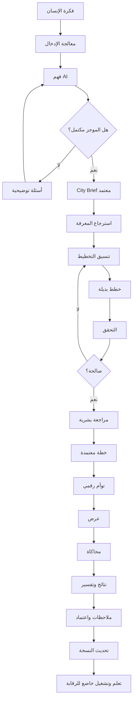
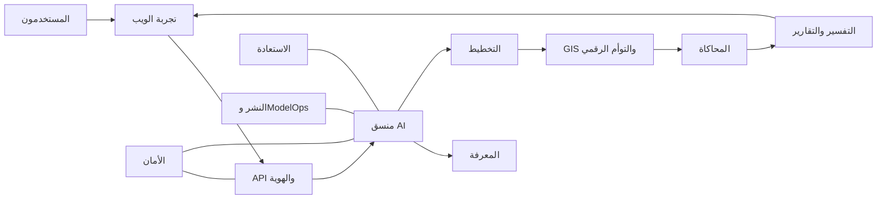
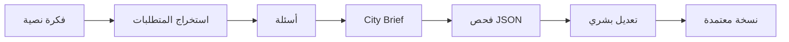

# الهيكل الكامل لمسارات العمل

**[English](../WORKFLOW_ARCHITECTURE.md) | العربية**

يربط هذا الملف جميع مسارات AI Future Lab في نظام واحد، ويوضح الاعتماد بين المراحل والبيانات المشتركة وبوابات الاعتماد ومسارات الأخطاء.

الهيكل المقترح مستقبلي، والمنصة المتكاملة غير منفذة حاليًا.

---

## 1. دورة الحياة الكاملة



تبدأ العملية بفكرة بشرية وتنتهي بنسخة تمت مراجعتها بشريًا، وليس بقرار ذاتي للذكاء الاصطناعي.

---

## 2. حالات العناصر

كل عنصر مهم له حالة:

```text
مسودة
ينتظر معلومات
جاهز للمراجعة
فشل التحقق
يحتاج مختصًا
معتمد
مرفوض
استُبدل بنسخة أحدث
مؤرشف
```

تمنع الحالات الخلط بين المحتوى المولد والخطة المعتمدة.

---

## 3. نظام الإصدارات

يتم حفظ إصدارات لـ:

- City Brief
- الخطة البديلة
- التوأم الرقمي
- السيناريو
- نموذج المحاكاة
- Prompt
- نموذج AI
- قاعدة أو سياسة
- تقرير
- إصدار برمجي

مثال:

```text
Brief v0.1 استخراج أولي
Brief v0.2 تصحيح السكان
Brief v0.3 إضافة مراحل التطوير
Brief v1.0 اعتماد الموجز
```

---

# المسار 1 — النظرة العامة

## الهدف

عرض النظام كاملًا على مستوى عالٍ.

## المدخل

فكرة مدينة أو منطقة.

## المخرج

فهم بصري لمكان:

- دخول المعلومات
- فهم AI
- التخطيط
- التوأم الرقمي
- السيناريوهات
- التفسير
- الاعتماد
- الأمان والتحسين

## القيمة

يوضح أن المشروع ليس Chatbot أو خريطة أو لعبة فقط، بل Workflow متصل.

---

# المسار 2 — إدخال الإنسان وفهم AI

## شروط الدخول

- المستخدم مصرح له.
- نوع الإدخال مدعوم.
- الملفات مصرح بها.

## الخطوات

1. حفظ الطلب الأصلي.
2. اكتشاف اللغة.
3. تحويل الصوت إلى نص.
4. استخراج الهدف.
5. استخراج القيم.
6. استخراج القيود.
7. تحديد الأولويات.
8. اكتشاف التعارض.
9. اكتشاف النقص.
10. طرح الأسئلة.
11. بناء الموجز.
12. المراجعة البشرية.

## عقد المخرج

```json
{
  "brief_id": "brief-001",
  "version": "v1.0",
  "status": "approved",
  "goals": [],
  "constraints": [],
  "priorities": [],
  "assumptions": [],
  "open_questions": []
}
```

## التحقق

- الحقول المطلوبة
- الوحدات
- نطاق الأرقام
- فصل الافتراضات
- تأكيد المستخدم

## مسار الخطأ

```text
قيمة غير مؤكدة
→ وضع علامة
→ سؤال المستخدم
→ تصحيح
→ تحديث
→ إعادة تحقق
```

---

# المسار 3 — النواة الذكية

## الهدف

تنسيق النماذج والأدوات والذاكرة والأدلة.

## المكونات

- مدير السياق
- مخطط المهام
- باني الـPrompt
- موجه النموذج
- موجه الأدوات
- مدير الذاكرة
- مدير التحقق
- منسق القرار
- جامع الأدلة
- مدير الأخطاء

## سجل المهمة

```json
{
  "task_id": "task-204",
  "project_version": "brief-v1.0",
  "task_type": "candidate_land_use",
  "model_version": "approved-model",
  "tools": ["gis-check-v1"],
  "status": "completed",
  "validation": "passed"
}
```

## الأخطاء

- مخرج غير صالح
- دليل ناقص
- طلب بلا صلاحية
- انتهاء الوقت
- تعارض الأدوات
- بلوغ حد الإعادة

## الاستعادة

حماية النسخة المعتمدة، ثم إعادة آمنة أو تصعيد أو توقف.

---

# المسار 4 — التخطيط والتوأم الرقمي

## شروط الدخول

- موجز معتمد
- بيانات موقع أو افتراضات واضحة
- مصادر أساسية

## التسلسل

1. تحليل الموقع.
2. تقدير الطلب.
3. استخدامات الأراضي.
4. المناطق والأحياء.
5. التنقل.
6. الخدمات.
7. الاستدامة.
8. تركيب الخطط.
9. التحقق.
10. المقارنة.
11. الاختيار البشري.
12. إنشاء التوأم الرقمي.

## عقد الخطة

```json
{
  "candidate_id": "candidate-b",
  "base_brief": "brief-v1.0",
  "strategy": "multi-center",
  "assumptions": [],
  "objects": [],
  "metrics": {},
  "risks": [],
  "validation_status": "requires_review"
}
```

## عقد التوأم الرقمي

```json
{
  "twin_version": "twin-v0.1",
  "source_candidate": "candidate-b",
  "approval_status": "approved",
  "objects": [],
  "relationships": [],
  "metrics": {}
}
```

## الفشل

- مخالفة الموجز
- Geometry غير صالح
- خدمة ناقصة
- تعارض سعة
- مخالفة قاعدة
- وصول غير عادل
- حساب بلا دليل

---

# المسار 5 — العرض والمحاكاة

## شروط الدخول

- نسخة توأم صالحة
- سيناريو واضح
- نموذج معتمد

## العرض

- تحميل النسخة
- إظهار الطبقات
- فحص العناصر
- مقارنة النسخ

## المحاكاة

1. تعريف السيناريو.
2. التحقق من المدخلات.
3. تشغيل النموذج.
4. حفظ النتائج.
5. المقارنة بالخطة الأساسية.

## عقد السيناريو

```json
{
  "scenario_id": "growth-30",
  "base_twin": "twin-v0.1",
  "model_version": "population-demand-v1",
  "inputs": {},
  "results": {},
  "limitations": [],
  "review_status": "draft"
}
```

Godot وUnity وUnreal خيارات عرض مستقبلية فقط.

---

# المسار 6 — النتائج والتفسير

## المراحل

1. اختيار النتائج المهمة.
2. إنشاء ملخص مؤشرات.
3. ربط التوصية بالأدلة.
4. إنشاء التقارير.
5. الحفاظ على التطابق بين العربية والإنجليزية.

## عقد التفسير

```json
{
  "recommendation_id": "rec-08",
  "recommendation": "Add a local clinic",
  "reason": "Service access gap",
  "evidence": ["access-test-20"],
  "assumptions": [],
  "alternatives": [],
  "uncertainty": "moderate",
  "required_reviewer": "healthcare planner"
}
```

## الأخطاء

- دليل ناقص
- افتراض مخفي
- ترجمة تغير المعنى
- إخفاء بديل
- توصية تتجاوز قدرة النموذج

---

# المسار 7 — الأخطاء والاستعادة

## الأنواع

- مستخدم
- بيانات
- AI
- أداة
- أمان
- نشر

## درجات الخطورة

- معلوماتي
- منخفض
- متوسط
- عالٍ
- حرج

## المسار

```text
اكتشاف
→ تصنيف
→ إيقاف العملية الخطرة
→ حماية النسخة
→ جمع السجلات
→ إعادة آمنة
→ تصعيد
→ اختبار الاستعادة
→ تقرير حادث
```

---

# المسار 8 — الأمان وAPI والمراقبة

## المجالات

- الهوية
- الصلاحيات
- API
- البيانات
- الأسرار
- المراقبة
- الحوادث
- النسخ الاحتياطي

## القاعدة

الأمان موجود في كل المسارات، وليس صفحة منفصلة فقط.

---

# المسار 9 — التعلم الخاضع للرقابة

## المدخلات المسموحة

- تصحيحات مختصين
- تقييمات
- أخطاء متكررة
- موثوقية الأدوات
- ملاحظات معتمدة

## المسار

1. التحقق من الإذن.
2. إزالة البيانات غير الضرورية.
3. تحديد الفرضية.
4. إنشاء اختبار.
5. تجربة Sandbox.
6. مقارنة.
7. مراجعة سلامة وعدالة.
8. موافقة.
9. إطلاق محدود.
10. مراقبة.
11. اعتماد أو رجوع.

---

# المسار 10 — النشر والتشغيل

```text
Development
→ Tests
→ Staging
→ Pilot
→ Production
```

## المراحل

- مراجعة الكود
- اختبارات آلية
- تقييم AI
- نشر Staging
- قبول بشري
- إطلاق تدريجي
- مراقبة
- رجوع

---

# المسار 11 — الربط النهائي



## مخازن البيانات

- المشاريع والموجزات
- GIS
- الملفات
- الأدلة
- نتائج السيناريوهات
- سجل النماذج
- سجل التدقيق

كل مخرج يجيب:

- لأي مشروع؟
- أي نسخة؟
- أي متطلب؟
- أي مصدر؟
- أي نموذج أو أداة؟
- أي تحقق؟
- أي موافقة؟

---

# عقود البيانات بين المسارات

## City Brief

- محفوظ الإصدارات
- حالة اعتماد
- وحدات واضحة
- فصل الافتراضات
- أسئلة مفتوحة

## الخطة البديلة

- مرتبطة بالموجز
- تحتوي افتراضات
- مؤشرات
- تحقق
- أدلة

## التوأم الرقمي

- معرفات
- Geometry
- خصائص
- علاقات
- نسخة
- حالة

## السيناريو

- نسخة أساسية
- مدخلات متغيرة
- نموذج
- نتائج
- حدود

## التفسير

- توصية
- سبب
- دليل
- افتراض
- بدائل
- عدم يقين
- مراجع

---

# خريطة الموافقات

```text
City Brief → صاحب المشروع
مصدر البيانات → مسؤول البيانات
الخطة → مخطط
الحساب المتخصص → مختص
نسخة التوأم → معتمد المشروع
قرار عالي الخطورة → جهة مسؤولة
نموذج AI → مسؤول النماذج والأمان
إصدار البرنامج → اعتماد النشر
```

---

# مثال كامل

1. فكرة منطقة مستدامة لـ50 ألف نسمة.
2. استخراج الإسكان والخدمات والنقل والمياه.
3. أسئلة عن الموقع والمساحة والمراحل.
4. اعتماد Brief v1.0.
5. استرجاع البيانات.
6. إنشاء ثلاث خطط.
7. رفض خطة لفشل الوصول للخدمات.
8. مقارنة خطتين.
9. اختيار خطة مراكز أحياء مع تعديل النقل.
10. إنشاء Twin v0.1.
11. اختبار نمو 30%.
12. اكتشاف ضغط على المدارس والصحة.
13. إنشاء توصيات مع أدلة.
14. إنشاء Twin v0.2.
15. مراجعة واعتماد بشري.

---

# مبادئ الهيكل

- يركز على الإنسان
- يعتمد على الأدلة
- قابل للتفسير
- قابل للتتبع
- آمن
- مقسم إلى وحدات
- سهل الوصول
- ثنائي اللغة
- صادق في الحالة

---

# الحدود الحالية

## موثق

- الهيكل
- مسارات AI
- السلامة
- خارطة الطريق
- المواصفات
- المخططات
- أكواد عرض أولية

## غير منفذ كمنصة

- Orchestrator
- RAG
- Planning Engine
- Digital Twin
- Simulation
- Professional Reports
- Production Security

---

# أول Workflow عملي



يجب اختبار هذا الجزء قبل التوليد التلقائي للمدن أو العرض المتقدم.
